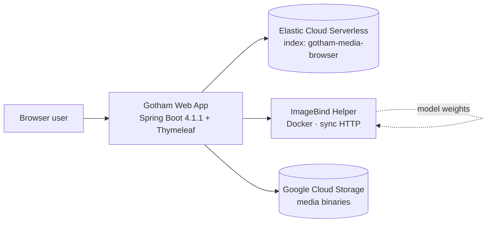
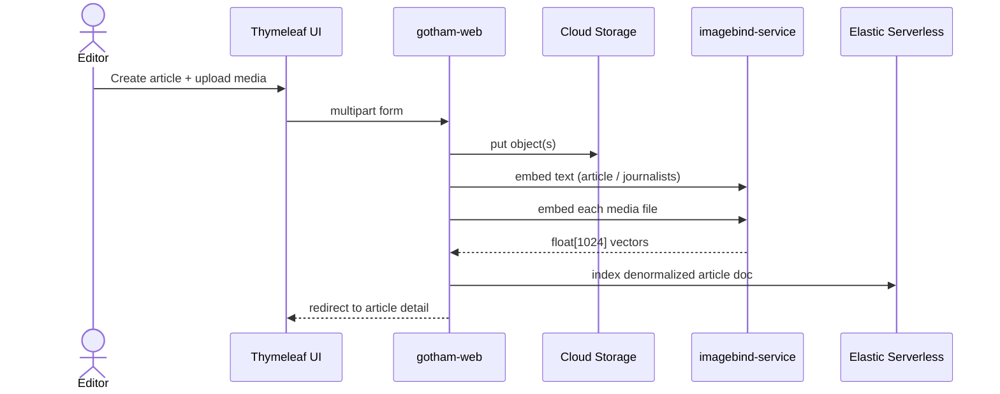
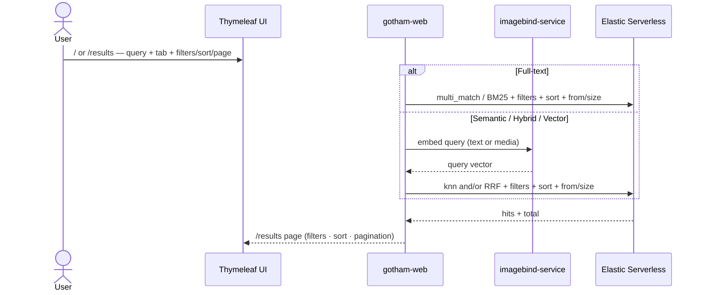

# Gotham News & Media Browser — Component Architecture

**Status:** Locked for prototype (local Docker Compose)  
**Date:** 2026-09-06

## Decisions locked

| Topic | Decision |
|-------|----------|
| Search persistence | **Elastic Cloud Serverless** only (no RDBMS) |
| Auth to ES | API key |
| Object storage | **Google Cloud Storage** (service account to be provided) |
| Embeddings | **Meta ImageBind** (open source), self-hosted Docker helper |
| Embedding dims | **1024** (ImageBind huge `out_embed_dim`) |
| ImageBind call pattern | Synchronous HTTP from Spring Boot |
| Modalities | Image, audio, video (+ text queries via ImageBind text encoder) |
| App stack | Java 25 · Spring Boot 4.1.1 · Maven 3.9.x · Thymeleaf · Elasticsearch Java API Client (Boot-managed, 9.4.x) |
| UI | Server-rendered Thymeleaf only; search mode **tabs** (UX priority) |
| Landing | `/` — **two panels**: article search · multimedia search |
| Admin | `/admin` — CRUD for journalists & articles (+ metadata / media) |
| Results | `/results` — entity-scoped hits with filters, sorting, pagination |
| Runtime | Local **Docker Compose** |
| Users / auth | Out of scope (single-user demo; `/admin` open) |

## System context



## Components

### 1. `gotham-web` — Spring Boot web application
- **Role:** Frontend + backend in one deployable.
- **UI routes (see [`frontend-information-architecture.md`](./frontend-information-architecture.md)):**
  - `GET /` — landing with **two search panels** (articles vs multimedia; methods per entity)  
  - `GET /results` — **entity-scoped** results with **filters**, **sorting**, **pagination**  
  - `GET /articles/{id}` — article detail  
  - `/admin/**` — **CRUD** for **journalists** and **articles** (metadata + multimedia upload)
- **Search methods by panel:**
  - Articles: Full-text · Semantic · Hybrid  
  - Multimedia: Full-text · Semantic · Hybrid · Vector
- **API/MVC:** Controllers for pages + form posts; services for ES, GCS, ImageBind.
- **ES access:** Official Elasticsearch Java API Client via Spring Boot auto-config (`spring.elasticsearch.*` + API key).
- **Secrets (local):** env vars / Compose secrets — `ELASTIC_ENDPOINT`, `ELASTIC_API_KEY`, `GCS_*` / service-account JSON path, `IMAGEBIND_BASE_URL`.

### 2. `imagebind-service` — Meta ImageBind helper (Docker)
- **Role:** Create 1024-d embeddings for ingest and query time.
- **Source:** Official Meta ImageBind research code, wrapped in a thin FastAPI/Flask (or similar) HTTP API.
- **Endpoints (proposed):**
  - `POST /v1/embed/text` → `{ vector: float[1024] }`
  - `POST /v1/embed/image` (multipart) → vector
  - `POST /v1/embed/audio` (multipart) → vector
  - `POST /v1/embed/video` (multipart) → vector
- **Sync:** Web app waits for embedding before indexing / before search knn.
- **Hardware note:** CPU works for prototype; GPU optional if the test machine has one.

### 3. Elastic Cloud Serverless
- **Index:** `gotham-media-browser`
- **Stores:** Denormalized article documents (journalists + multimedia nested).
- **Does not** run Elastic managed inference / `semantic_text` for this prototype — all embeddings come from ImageBind.

### 4. Google Cloud Storage
- **Stores:** Physical multimedia files (image / audio / video).
- **ES stores:** `storage_uri` + metadata + `asset_vector`, not the binary.
- **Auth:** GCP service account JSON mounted into `gotham-web`.

## Search semantics (how tabs map to engines)

ImageBind uses **one joint embedding space**. That drives a clean split:

| UX tab | Article | Journalist | Multimedia |
|--------|---------|------------|------------|
| **Full-text** | BM25 on `article_search_text` | BM25 on `journalist_search_text` | BM25 on `multimedia_search_text` |
| **Semantic** | kNN on `article_embedding` (query text → ImageBind) | kNN on `journalist_embedding` | kNN on `multimedia.asset_vector` (query **text** → ImageBind) |
| **Hybrid** | RRF(BM25, article kNN) | RRF(BM25, journalist kNN) | RRF(BM25, asset kNN) |
| **Vector** | *Not offered* | *Not offered* | kNN on `multimedia.asset_vector` (query **image/audio/video** → ImageBind) |

So for multimedia, **Semantic** and **Vector** both knn against `asset_vector`; they differ by **query modality** (text vs media upload).

## Embedding fields in ES (aligned to ImageBind)

| Field | dims | Produced by | Used for |
|-------|------|-------------|----------|
| `article_embedding` | 1024 | ImageBind **text** over article title/summary/body (indexer) | Article semantic + hybrid |
| `journalist_embedding` | 1024 | ImageBind **text** over names/bios (indexer) | Journalist semantic + hybrid |
| `multimedia.asset_vector` | 1024 | ImageBind **image/audio/video** of the asset | Multimedia semantic, vector, hybrid |

No root article/journalist “vector search” field is exposed in the UX.

## Ingest flow (synchronous)



## Query flow (search tabs)



Public IA details: [`frontend-information-architecture.md`](./frontend-information-architecture.md).

## Docker Compose topology (local)

```text
services:
  gotham-web          # Spring Boot :8080
  imagebind-service   # ImageBind HTTP :8081 (example)

external:
  Elastic Cloud Serverless  (URL + API key)
  Google Cloud Storage      (bucket + SA)
```

Compose does **not** run Elasticsearch or GCS locally.

## Software stack pins

| Layer | Choice |
|-------|--------|
| Language | Java **25** |
| Framework | Spring Boot **4.1.1** (`spring-boot-starter-web`, `thymeleaf`, `elasticsearch` / `data-elasticsearch` as needed) |
| Build | Maven **3.9.x** + `spring-boot-maven-plugin` 4.1.1 |
| ES client | `co.elastic.clients:elasticsearch-java` via Boot BOM (**9.4.x**) |
| UI | Thymeleaf (Boot-managed latest) |
| GCS SDK | Google Cloud Storage Java client |
| ImageBind | Meta open-source + thin REST wrapper image |

## Out of scope for prototype
- User login / roles
- Async queues / workers
- HA, multi-region, ILM
- Elastic managed inference endpoints
- Separate SPA frontend

## Follow-ups when credentials arrive
1. Elastic Cloud Serverless endpoint + API key  
2. GCS bucket name + service account JSON  
3. Confirm ImageBind runtime (CPU vs GPU) on the test machine  
