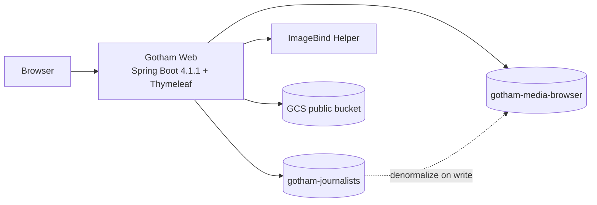

# Gotham News & Media Browser — Component Architecture

**Status:** Locked for prototype (local Docker Compose)  
**Date:** 2026-09-06  
**Persistence:** Elastic Cloud Serverless + Google Cloud Storage only (no RDBMS)

## Decisions locked

| Topic | Decision |
|-------|----------|
| Logical ER | Design aid only — **not** a physical database |
| Persistence | **Elastic Cloud Serverless** + **GCS** only |
| Document IDs | **Elasticsearch auto `_id`** for top-level docs |
| Journalist master data | Index **`gotham-journalists`** (feeds article nested authors) |
| Article / media search index | **`gotham-media-browser`** (one doc per article) |
| Auth to ES | API key |
| Object storage | **GCS public bucket objects** (no signed URLs) |
| Embeddings | Meta ImageBind (OSS), Docker helper, sync HTTP, **1024-d** |
| Modalities | Image, audio, video (+ text queries via ImageBind text) |
| App stack | Java 25 · Spring Boot 4.1.1 · Maven 3.9.x · Thymeleaf · ES Java API Client 9.4.x |
| Landing | `/` — two panels: articles · multimedia |
| Journalist CRUD | `/journalist` — full CRUD on `gotham-journalists` |
| Article CRUD | `/article` — full CRUD on denormalized `gotham-media-browser` docs (status: DRAFT / PUBLISHED / ARCHIVED) |
| Results | `/results` — filters (incl. **status** + **journalist** on article FTS), sort, pagination |
| Journalist UI search | **No** dedicated public journalist search UI |
| Journalist as search param | **Yes** — article full-text accepts `journalist` filter/param |
| Runtime | Local Docker Compose |
| Users / auth | Out of scope (`/journalist` and `/article` open) |

## System context



## Identity strategy (validated)

| Entity | ID | Notes |
|--------|----|-------|
| Journalist | ES auto `_id` on `gotham-journalists` | Returned after index; stored on article as `journalists.journalist_id` (`keyword`) |
| Article | ES auto `_id` on `gotham-media-browser` | Used in routes `/article/{id}` |
| Multimedia element | **App-assigned** `multimedia_element_id` (`keyword`) | Nested objects have no ES `_id`; required for `/article` delete/update of a single asset |

Flow:
1. Create journalist via `/journalist` → ES generates `_id` → keep for bylines.  
2. Create/update article via `/article` → resolve journalists by `_id` from `gotham-journalists` → nest snapshot + ids on article doc → ES auto `_id` for article.  
3. Media upload → app generates `multimedia_element_id` → GCS object key includes article `_id` + element id → ImageBind → nest on article → reindex article (same `_id`).

## Components

### 1. `gotham-web`
- Dual-panel landing; entity-scoped `/results`; `/journalist` + `/article` CRUD  
- Articles panel methods: Full-text · Semantic · Hybrid  
- Multimedia panel methods: Full-text · Semantic · Hybrid · Vector  
- Article FTS supports query params: `q`, `mode`, `status`, `section`, `language`, **`journalist`** (id or name), dates, sort, page  
- Services: ES (both indexes), GCS (public URLs), ImageBind  

### 2. `imagebind-service`
- Sync embed text / image / audio / video → `float[1024]`  

### 3. Elastic indexes
| Index | Grain | Role |
|-------|-------|------|
| `gotham-journalists` | 1 journalist | Master data for `/journalist` + article bylines |
| `gotham-media-browser` | 1 article | Public browse/search + `/article` CRUD; nested journalists + multimedia |

### 4. GCS
- Public objects; ES stores `storage_uri` (e.g. `https://storage.googleapis.com/...` or `gs://...` resolved to public HTTPS in UI)  
- No signed URLs  

## Local media limits (prototype)

Chosen for **local CPU** synchronous ImageBind:

| Media | Max size | Max duration |
|-------|----------|--------------|
| IMAGE | **10 MiB** | — |
| AUDIO | **20 MiB** | **5 minutes** |
| VIDEO | **50 MiB** | **90 seconds** |

Reject uploads over limit on `/article` forms with clear validation messages.

## Article status

`DRAFT` | `PUBLISHED` | `ARCHIVED`

- `/article` CRUD must set/change status.  
- Public `/` and `/results` **can return all statuses**; results expose a **status** filter (default may show all or PUBLISHED — UI should offer all three).

## Search semantics

| Tab | Articles | Multimedia |
|-----|----------|------------|
| Full-text | BM25 + filters (`status`, `journalist`, …) | BM25 on media text + filters |
| Semantic | kNN `article_embedding` (text→ImageBind) | kNN nested `asset_vector` (text→ImageBind) |
| Hybrid | RRF(BM25, article kNN) | RRF(BM25, asset kNN) |
| Vector | — | kNN `asset_vector` (media→ImageBind) |

Journalist: **not** a results entity. On article full-text, `journalist` param filters by nested `journalist_id` or `full_name`.

## Write paths

### Journalist CRUD
- Create/Update/Delete on `gotham-journalists`  
- On update/delete: find articles with that `journalists.journalist_id` and reindex (or block delete if referenced)

### Article CRUD
- Load journalists from `gotham-journalists` by id  
- Upload media to public GCS  
- ImageBind article text + each media file  
- Index/update `gotham-media-browser` with auto `_id` (create) or existing `_id` (update)

## Docker Compose

```text
services:
  gotham-web           # :8080
  imagebind-service    # :8081

external:
  Elastic Cloud Serverless  (URL + API key)  → indexes gotham-journalists, gotham-media-browser
  GCS public bucket         (SA for write; public read)
```

## Follow-ups when credentials arrive
1. ES endpoint + API key  
2. GCS bucket name + write-capable SA (objects public-readable)  
3. Confirm CPU-only ImageBind on the lab machine  
