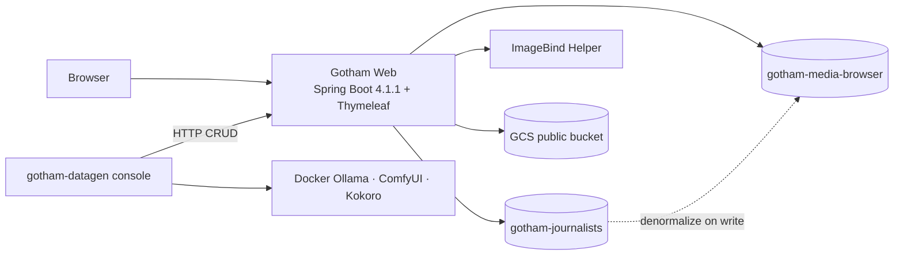

# Gotham News & Media Browser — Component Architecture

**Status:** Locked for prototype (local Docker Compose). **Implementation:** P0–P9 + P10-T01 done (37/42); next P10-T02 (Compose `datagen` profile) — [`implementation-state.md`](./implementation-state.md).  
**Date:** 2026-09-08  
**Persistence:** Elastic Cloud Serverless + Google Cloud Storage only (no RDBMS)  
**Canonical overview:** [`architecture-end-to-end.md`](./architecture-end-to-end.md)

## Decisions locked

| Topic | Decision |
|-------|----------|
| Logical ER | Design aid only — **not** a physical database |
| Persistence | **Elastic Cloud Serverless** + **GCS** only |
| Document IDs | **Elasticsearch auto `_id`** for top-level docs |
| Journalist master data | Index **`gotham-journalists`** (feeds article nested authors) |
| Article / media search index | **`gotham-media-browser`** (one doc per article) |
| Auth to ES | API key |
| Object storage | **GCS public bucket objects** (no signed URLs) |
| Embeddings | Meta ImageBind (OSS), Docker helper, sync HTTP, **1024-d** |
| Modalities | Image, audio, video (+ text queries via ImageBind text) |
| App stack | Java 25 · Spring Boot 4.1.1 · **Maven multi-module** (`gotham-common` + `gotham-web` + **`gotham-datagen` console** — non-Boot; skeleton in P10-T01) · Thymeleaf · ES Java API Client 9.4.x · package `com.gotham.newsmediabrowser` |
| ES credentials | Endpoint + API key: **placeholders** in committed `application.properties`; real values in untracked `application-local.properties` (or env) |
| GCS credentials | Bucket/project: placeholders in properties (real values in untracked override); SA JSON **secret file** `secrets/gcp-sa.json` |
| Landing | `/` — two panels: articles · multimedia |
| Journalist CRUD | `/journalist` — full CRUD on `gotham-journalists` |
| Journalist delete | **Cascade-strip** nested bylines + reindex articles, then delete master |
| Article CRUD | `/article` — full CRUD on denormalized `gotham-media-browser` docs (status: DRAFT / PUBLISHED / ARCHIVED) |
| Results | `/results` — filters (incl. **status** + **journalist** on article FTS), sort, pagination |
| Fault tolerance | Branded error pages with reason on **all** endpoints |
| Synthetic data | **Last phase P10** — Java **console** `gotham-datagen` (**not** Spring Boot) via HTTP CRUD; helpers **mandatory Docker** (Ollama / ComfyUI / Kokoro); Qwen 7B / SDXL-Turbo / Kokoro / Wan 1.3B ([`synthetic-data-generation.md`](./synthetic-data-generation.md)) |
| Journalist UI search | **No** dedicated public journalist search UI |
| Journalist as search param | **Yes** — article full-text accepts `journalist` filter/param |
| Embeddings build | ImageBind **in-repo** under `imagebind-service/` |
| Runtime | Local Docker Compose: web + ImageBind always; profile **`datagen`** for helper containers |
| Lab hardware | **MacBook Pro M4 · 32 GB · no NVIDIA** (CPU-in-container for helpers) |
| Users / auth | Out of scope (`/journalist` and `/article` open) |
| Implementation | [`implementation-plan.md`](./implementation-plan.md) · [`implementation-state.md`](./implementation-state.md) · [`testing-strategy.md`](./testing-strategy.md) |

## System context



## Identity strategy (validated)

| Entity | ID | Notes |
|--------|----|-------|
| Journalist | ES auto `_id` on `gotham-journalists` | Returned after index; stored on article as `journalists.journalist_id` (`keyword`) |
| Article | ES auto `_id` on `gotham-media-browser` | Used in routes `/article/{id}` |
| Multimedia element | **App-assigned** `multimedia_element_id` (`keyword`) | Nested objects have no ES `_id`; required for `/article` delete/update of a single asset |

Flow:
1. Create journalist via `/journalist` → ES generates `_id` → keep for bylines.  
2. Create/update article via `/article` → resolve journalists by `_id` from `gotham-journalists` → nest snapshot + ids on article doc → ES auto `_id` for article.  
3. Media upload → app generates `multimedia_element_id` → GCS object key includes article `_id` + element id → ImageBind → nest on article → reindex article (same `_id`).

## Components

### 1. Maven modules
| Module | Role |
|--------|------|
| parent `gotham-news-media-browser` | BOM, Java 25, module list (IntelliJ Ultimate import) |
| `gotham-common` | Config properties, ES/GCS/ImageBind clients, repositories, projections, domain |
| `gotham-web` | Spring Boot app, Thymeleaf controllers/views, static assets, global error handling |
| `gotham-datagen` | **P10 (last):** Java **console** `main` (not Spring Boot) — generate text/media → `POST /journalist` & `/article` |

### 2. `gotham-web` (runtime)
- Dual-panel landing; entity-scoped `/results` (**full-text shipped**); `/journalist` + `/article` CRUD  
- Articles panel methods: Full-text · Semantic · Hybrid (all execute; **shipped P8**)  
- Multimedia panel methods: Full-text · Semantic · Hybrid · Vector (all execute; **shipped P8**)  
- Results query params: `entity`, `q`, `mode`, `fields`, `status`, `section`, `language`, **`journalist`** (article FTS), `mediaType`, `published_from` / `published_to`, `sort`, `page`, `size` ∈ {25, 50, 100}  
- Services: ES (both indexes), GCS (public URLs), ImageBind (write-path embeddings)  
- Health: ImageBind `http://imagebind-service:8081/health` · ES via `/api/health/elasticsearch` · app `/api/health/imagebind`  
- **Fault tolerance:** global `@ControllerAdvice` / error templates for **all** endpoints — branded error page with **reason** + reference id; Whitelabel off; client timeouts on ES/ImageBind/GCS (see [`ui-design-errors.md`](./ui-design-errors.md))

### 3. `imagebind-service`
- Sync embed text / image / audio / video → `float[1024]` · **built in-repo** (FastAPI, CPU default)
- Endpoints: `GET /health` · `POST /embed/text` (JSON) · `POST /embed/{image,audio,video}` (multipart `file`)
- Real Meta ImageBind by default; **deterministic stub** backend for CI / no weights (Java side: `gotham.imagebind.stub=true`); loading the real model needs Docker RAM **≥ 12 GB**

### 4. `gotham-datagen` (P10)
- **Java console application** (`public static void main`) — **not** Spring Boot; **no** public UI  
- Calls modality helpers over HTTP, then loads data **only** through live CRUD APIs  
- Defaults: **15** journalists · **25** articles · **5** IMAGE + **5** AUDIO + **5** VIDEO (5 s) per article  
- Lab: **MacBook Pro M4 · 32 GB · no NVIDIA**  
- Helpers: **mandatory Docker** Compose profile `datagen` — `ollama/ollama`, in-repo `comfyui-service/` (CPU), `kokoro-fastapi-cpu`  
- Models: **Qwen 2.5 7B-Instruct** · **SDXL-Turbo** · **Kokoro-82M** · **Wan2.1 T2V-1.3B**  
- Spec: [`synthetic-data-generation.md`](./synthetic-data-generation.md)

### 5. Elastic indexes
| Index | Grain | Role |
|-------|-------|------|
| `gotham-journalists` | 1 journalist | Master data for `/journalist` + article bylines |
| `gotham-media-browser` | 1 article | Public browse/search + `/article` CRUD; nested journalists + multimedia |

### 6. GCS
- Public objects; ES stores `storage_uri` (e.g. `https://storage.googleapis.com/...` or `gs://...` resolved to public HTTPS in UI)  
- No signed URLs  
- SA JSON loaded from secret file path in `application.properties`

## Local media limits (prototype)

Chosen for **local CPU** synchronous ImageBind:

| Media | Max size | Max duration |
|-------|----------|--------------|
| IMAGE | **10 MiB** | — |
| AUDIO | **20 MiB** | **5 minutes** |
| VIDEO | **50 MiB** | **90 seconds** |

Reject uploads over limit on `/article` forms with clear validation messages.

## Article status

`DRAFT` | `PUBLISHED` | `ARCHIVED`

- `/article` CRUD must set/change status.  
- Public `/` and `/results` **can return all statuses**; results expose a **status** filter (default may show all or PUBLISHED — UI should offer all three).

## Search semantics

| Tab | Articles | Multimedia |
|-----|----------|------------|
| Full-text | BM25 + filters (`status`, `journalist`, …) | BM25 on media text + filters |
| Semantic | kNN `article_embedding` (text→ImageBind) | kNN nested `asset_vector` (text→ImageBind) |
| Hybrid | RRF(BM25, article kNN) | RRF(BM25, asset kNN) |
| Vector | — | kNN `asset_vector` (media→ImageBind) |

**Full Query DSL for every mode:** [`elasticsearch-search-methods.md`](./elasticsearch-search-methods.md)

**Live today (through P8):** article + multimedia BM25 (journalist/status/filters, nested `inner_hits` asset cards); **semantic kNN** (§5/§8), **hybrid RRF** (§6/§9), and multimedia **file→vector** (§10). Article `mode=vector` → HTTP 400.

Journalist: **not** a results entity. On article full-text, `journalist` param filters by nested `journalist_id` or `full_name`.

## Write paths

### Journalist CRUD
- Create/Update/Delete on `gotham-journalists`  
- On update: find articles with that `journalists.journalist_id` and reindex nested snapshots  
- On delete: **cascade-strip** nested bylines from all referencing articles, rebuild projections, reindex, then delete journalist

### Article CRUD
- Load journalists from `gotham-journalists` by id  
- Upload media to public GCS  
- ImageBind article text + each media file  
- Index/update `gotham-media-browser` with auto `_id` (create) or existing `_id` (update)

## Docker Compose

```text
services (always):
  gotham-web           # :8080
  imagebind-service    # :8081 (CPU OK on Mac)

services (profile: datagen — P10, mandatory for synthetic load):
  ollama               # ollama/ollama:latest → Qwen 2.5 7B-Instruct
  comfyui              # build ./comfyui-service (CPU; SDXL-Turbo + Wan2.1 1.3B)
  kokoro               # ghcr.io/remsky/kokoro-fastapi-cpu

external:
  Elastic Cloud Serverless  (URL + API key)  → indexes gotham-journalists, gotham-media-browser
  GCS public bucket         (SA for write; public read)
```

## Follow-ups for operators

1. Put real Elastic Cloud endpoint + API key into `gotham-web` `application-local.properties` (untracked) — not the committed `application.properties`  
2. Put real GCS project/bucket into `application-local.properties` (untracked); place SA JSON at `secrets/gcp-sa.json` (never commit)  
3. Confirm CPU ImageBind on the Mac for in-repo `imagebind-service`  
4. For P10: `docker compose --profile datagen up -d`; raise Docker Desktop memory; expect long CPU wall-clock for 125×5 s videos
