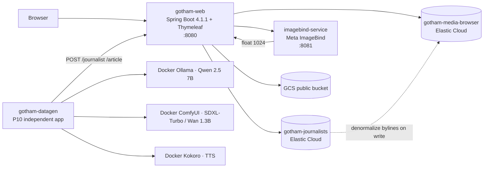
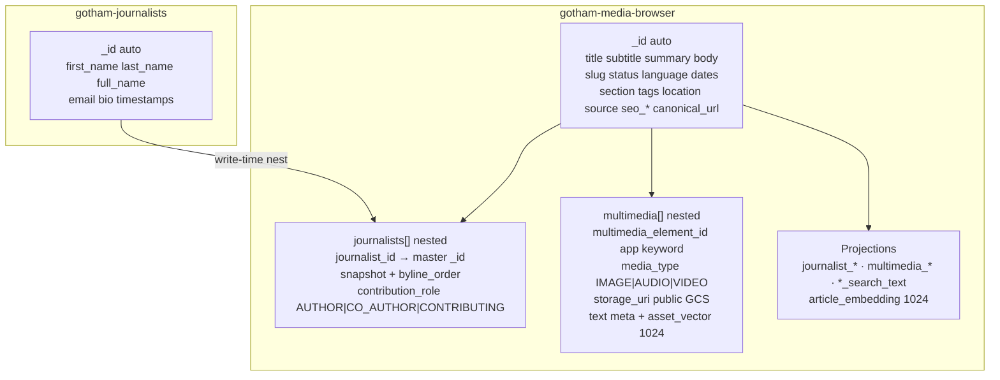
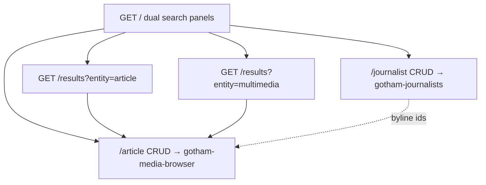
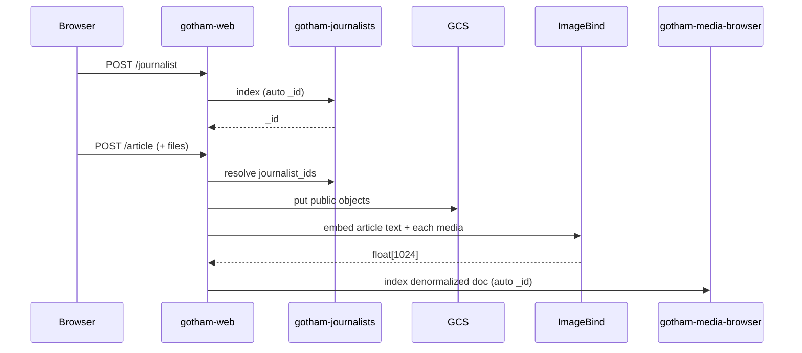

# Gotham News & Media Browser — End-to-End Architecture

**Status:** Reviewed & synced (2026-09-07)  
**Product:** Single-brand online news & multimedia browser prototype  
**Persistence:** Elastic Cloud Serverless + public GCS (no RDBMS)  
**App:** Java 25 · Spring Boot 4.1.1 · Thymeleaf · **Maven multi-module** (`gotham-common` + `gotham-web` + **`gotham-datagen` in P10**) · Elasticsearch Java API Client · Docker Compose  

Open parent `pom.xml` in IntelliJ IDEA Ultimate.

This is the **canonical architecture overview**. Detail specs live in linked docs.

| Concern | Doc |
|---------|-----|
| Logical ER (design aid) | [`er-design.md`](./er-design.md) |
| ES indexes & write rules | [`elasticsearch-denormalized-model.md`](./elasticsearch-denormalized-model.md) |
| ES search methods (Query DSL) | [`elasticsearch-search-methods.md`](./elasticsearch-search-methods.md) |
| Index diagrams | [`elasticsearch-denormalized-diagram.md`](./elasticsearch-denormalized-diagram.md) |
| Components & search modes | [`architecture-components.md`](./architecture-components.md) |
| Routes & IA | [`frontend-information-architecture.md`](./frontend-information-architecture.md) |
| Search / results UI | [`ui-design-search-results.md`](./ui-design-search-results.md) |
| CRUD UI | [`ui-design-crud.md`](./ui-design-crud.md) |
| Error / fault-tolerance UX | [`ui-design-errors.md`](./ui-design-errors.md) |
| Synthetic data (P10 last) | [`synthetic-data-generation.md`](./synthetic-data-generation.md) |
| Implementation plan | [`implementation-plan.md`](./implementation-plan.md) |
| Implementation state | [`implementation-state.md`](./implementation-state.md) |
| Mappings | [`../elasticsearch/`](../elasticsearch/) |
| UI mockups | [`../ui-mockups/`](../ui-mockups/) |

---

## 1. System context



| Component | Role |
|-----------|------|
| `gotham-web` | Search UI, `/journalist` + `/article` CRUD, ES client, GCS upload, ImageBind client, health legends, **global error pages** |
| `gotham-datagen` | **P10 (last):** independent Java app — synthetic journalists/articles via HTTP CRUD; orchestrates modality helpers |
| `imagebind-service` | Sync HTTP embed text/image/audio/video → `float[1024]` |
| Ollama / ComfyUI / Kokoro | Native macOS helpers (Metal/MPS) for P10 — Qwen 7B / SDXL-Turbo / Wan 1.3B / Kokoro |
| `gotham-journalists` | Journalist master documents (ES auto `_id`) |
| `gotham-media-browser` | One denormalized article doc + nested journalists + nested multimedia |
| GCS | Public object storage for media binaries (`storage_uri` HTTPS) |

**Out of scope:** RDBMS, auth/login, Elastic managed inference / `semantic_text`, journalist public search UI, signed URLs, writing ES/GCS from datagen bypassing the app.

---

## 2. Identity & data model



Logical ER (`er-design.md`) remains a **design aid only** — not a physical schema.

---

## 3. HTTP surface



| Area | Routes |
|------|--------|
| Search | `GET /` · `GET /results` |
| Journalists | `GET/POST /journalist` · `GET /journalist/new` · `GET/POST /journalist/{id}` · `POST /journalist/{id}/delete` |
| Articles | `GET/POST /article` · `GET /article/new` · `GET/POST /article/{id}` · `POST /article/{id}/delete` |
| Health (for chrome legends) | ImageBind `:8081/health` · app `/api/health/elasticsearch` |

**No `/admin` hub.**

### Search params ↔ Elasticsearch

| UI | ES |
|----|----|
| `page` (1-based), `size` ∈ {25, 50, 100} | `from = (page-1)*size`, `size`, `track_total_hits` |
| `published_from` / `published_to` | range on `published_at` |
| `fields` (FTS checkboxes) | `multi_match` (map `section`→`section.text`, etc.) |
| `mode=fulltext\|semantic\|hybrid\|vector` | BM25 / kNN / RRF / media→vector kNN — **see [`elasticsearch-search-methods.md`](./elasticsearch-search-methods.md)** |
| `status`, `section`, `language`, `journalist`, `mediaType`, `sort` | filters + sort |

---

## 4. Search capabilities

| Entity | Full-text | Semantic | Hybrid | Vector |
|--------|:---------:|:--------:|:------:|:------:|
| Article | ✓ (+ `journalist` filter) | ✓ `article_embedding` | ✓ RRF | ✗ |
| Multimedia | ✓ nested / projections | ✓ text→`asset_vector` | ✓ RRF | ✓ media file→`asset_vector` |
| Journalist | CRUD only | ✗ | ✗ | ✗ |

Status `DRAFT` | `PUBLISHED` | `ARCHIVED` is filterable on public search.

Local upload limits (ImageBind CPU): IMAGE 10 MiB · AUDIO 20 MiB / 5 min · VIDEO 50 MiB / 90 s.

---

## 5. Write path



Journalist update reindexes articles nesting that `journalist_id`.  
Journalist **delete cascade-strips** nested bylines from all referencing articles, rebuilds journalist projections, reindexes those articles, then deletes the `gotham-journalists` document.  
Article delete removes GCS objects + article doc.

---

## 5b. Fault tolerance & errors

All user-facing endpoints must fail **safely and visibly**:

- Branded Thymeleaf error page (shared chrome) with **HTTP status**, **human-readable reason**, and **reference id**  
- No Whitelabel / stack traces in the browser; full detail only in logs  
- Bounded timeouts on ES, ImageBind, and GCS; dependency outages → `503` with named service  
- Expected validation → form field errors; unexpected failures → error page  

Spec: [`ui-design-errors.md`](./ui-design-errors.md) · mockup: `ui-mockups/error.html`

---

## 6. Local Docker Compose (target)

```text
services (Compose — always):
  gotham-web           # :8080  Spring Boot + Thymeleaf (module gotham-web)
  imagebind-service    # :8081  Meta ImageBind helper (in-repo, CPU OK on Mac)

native macOS (P10 datagen helpers — not CUDA Docker):
  Ollama               # :11434  qwen2.5:7b-instruct (Metal)
  ComfyUI (MPS)        # :8188  SDXL-Turbo + Wan2.1 T2V-1.3B
  Kokoro               # :8880  Kokoro-82M TTS (CPU)

external:
  Elastic Cloud Serverless
  GCS public bucket
```

**Credentials (locked):** Elasticsearch endpoint + API key and GCS bucket/project ids are **hardcoded** in `gotham-web` `application.properties`. The GCS service account JSON key is a **secret file** under `secrets/` (gitignored; path in properties). Do not commit real keys.

**Lab hardware (locked):** MacBook Pro **M4 · 32 GB · no NVIDIA GPU**. Synthetic helpers use Apple Metal/MPS natively.

**Synthetic load:** independent Java app `gotham-datagen` posts to `/journalist` and `/article` only — defaults **15** / **25** / **5+5+5** (5 s videos); models **Qwen 7B / SDXL-Turbo / Kokoro / Wan 1.3B**; see [`synthetic-data-generation.md`](./synthetic-data-generation.md).

---

## 7. UI chrome

- Light pastel wash (`#F7F9FC` → `#EEF5F8`)
- Header: brand + ImageBind / Elasticsearch **Available | Unavailable** legends + nav (Search, results, Journalists, Articles)
- Footer: © 2020 Packt · © 2026 contributors · MIT License · year 2026
- Multimedia results & article edit: HTML5 `` / `<audio controls>` / `<video controls>`

---

## 8. Artifact map

```text
gotham-news-media-browser/
├── README.md
├── AGENTS.md
├── pom.xml                      # Maven parent (multi-module)
├── gotham-common/               # (to be created in P0)
├── gotham-web/                  # (to be created in P0)
├── gotham-datagen/              # (to be created in P10 — last)
├── imagebind-service/           # (to be created in P0/P6)
├── secrets/                     # SA JSON secret (gitignored) + *.example
├── docs/
│   ├── architecture-end-to-end.md   ← this file
│   ├── er-design.md
│   ├── elasticsearch-denormalized-model.md
│   ├── elasticsearch-denormalized-diagram.md
│   ├── elasticsearch-search-methods.md
│   ├── architecture-components.md
│   ├── frontend-information-architecture.md
│   ├── ui-design-search-results.md
│   ├── ui-design-crud.md
│   ├── ui-design-errors.md
│   ├── synthetic-data-generation.md
│   ├── implementation-plan.md
│   └── implementation-state.md
├── elasticsearch/
│   ├── gotham-journalists.mapping.json
│   └── gotham-media-browser.mapping.json
├── diagrams/
│   └── gotham-media-browser-denormalized.svg
└── ui-mockups/
    ├── index.html
    ├── results-*.html
    ├── journalist*.html
    ├── article*.html
    ├── error.html
    ├── chrome.js · styles.css
    └── media/   # HTML5 fixtures
```

---

## 9. Review checklist (2026-09-07)

| Check | Result |
|-------|--------|
| Dual-index ES + public GCS, no RDBMS | ✓ |
| Auto `_id` + app `multimedia_element_id` | ✓ |
| No `/admin`; `/journalist` + `/article` CRUD | ✓ |
| Journalist delete **cascade-strip** | ✓ |
| Search modes & ImageBind 1024-d in-repo | ✓ |
| ES search-methods Query DSL cookbook | ✓ |
| FTS attribute checkboxes + pagination 25/50/100 | ✓ |
| Status DRAFT\|PUBLISHED\|ARCHIVED | ✓ |
| `contribution_role` enum aligned with ER | ✓ |
| `canonical_url` on article forms + mapping | ✓ |
| `source.text` copy_to `article_search_text` | ✓ |
| Results filters wired to IA query params | ✓ |
| Article `mode=vector` → HTTP 400 error page | ✓ |
| Multi-module Maven (`gotham-common` + `gotham-web`; `gotham-datagen` in P10) | ✓ |
| ES/GCS props hardcoded; SA JSON secret file | ✓ |
| Fault-tolerant error pages (all endpoints) | ✓ |
| Synthetic data last phase P10 (M4 native; Qwen 7B / SDXL-Turbo / Kokoro / Wan 1.3B; 15/25/5+5+5) | ✓ |
| Implementation plan ↔ state (41 tasks, P0–P10) | ✓ |
