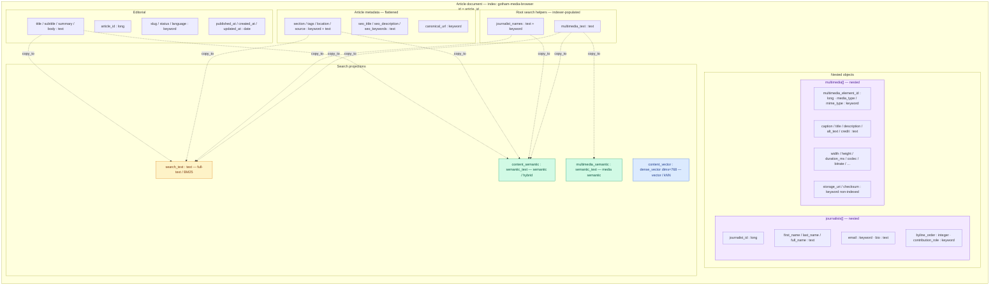
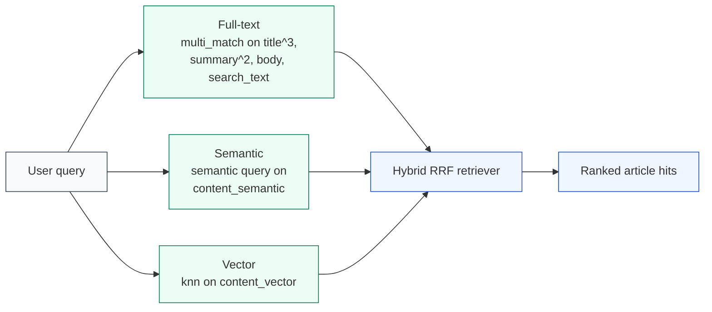
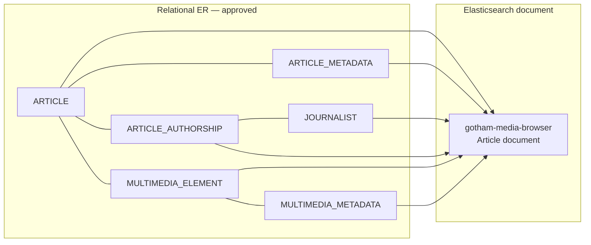

# Gotham News & Media Browser — Denormalized Model Diagram

**Index:** `gotham-media-browser` (Elasticsearch 9.x)  
**Related:** [`elasticsearch-denormalized-model.md`](./elasticsearch-denormalized-model.md) · [`../elasticsearch/gotham-media-browser.mapping.json`](../elasticsearch/gotham-media-browser.mapping.json)

## Document structure

## Search capability overlay

## Relational → denormalized mapping

## Legend

| Color / block | Meaning |
|---------------|---------|
| Editorial / metadata | Source fields denormalized onto the root document |
| `journalists[]` / `multimedia[]` | `nested` for filter-safe child queries |
| `search_text` | Lexical catch-all (BM25) |
| `*_semantic` | `semantic_text` for semantic and hybrid search |
| `content_vector` | Explicit `dense_vector` (768, cosine, int8_hnsw) |

Static SVG export: [`../diagrams/gotham-media-browser-denormalized.svg`](../diagrams/gotham-media-browser-denormalized.svg)  
Rendered overview image: [`../diagrams/gotham-media-browser-es-model.png`](../diagrams/gotham-media-browser-es-model.png)

