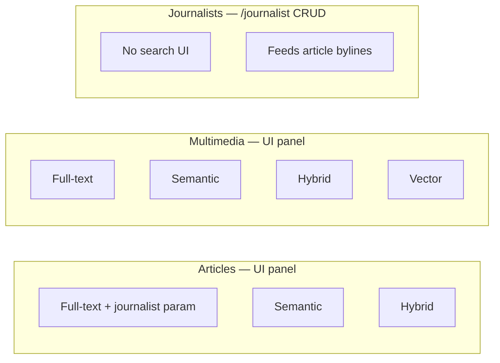
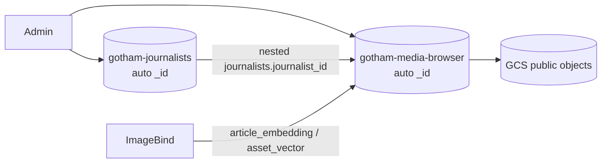
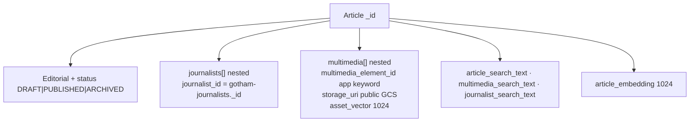

# Gotham News & Media Browser — Index Diagrams

**Indexes:** `gotham-journalists` · `gotham-media-browser`  
**IDs:** ES auto `_id` (top-level) · app `multimedia_element_id` (nested)  
**Related:** [`elasticsearch-denormalized-model.md`](./elasticsearch-denormalized-model.md)

## Capability matrix

## Dual-index topology

## Article document

