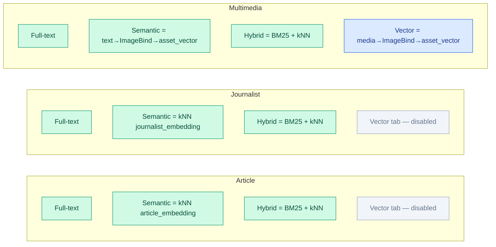
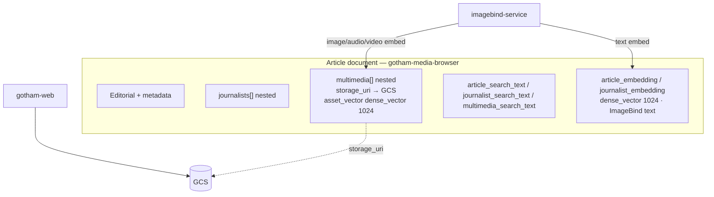
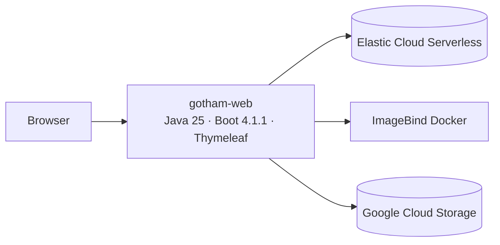

# Gotham News & Media Browser — Denormalized Model Diagram

**Index:** `gotham-media-browser` (Elastic Cloud Serverless)  
**Embeddings:** Meta ImageBind · 1024-d · no Elastic `semantic_text`  
**Related:** [`elasticsearch-denormalized-model.md`](./elasticsearch-denormalized-model.md) · [`architecture-components.md`](./architecture-components.md)

## Search capability matrix

## Document structure

## Component context

## Legend

| Item | Meaning |
|------|---------|
| `*_search_text` | BM25 full-text |
| `article_embedding` / `journalist_embedding` | ImageBind **text** embeddings for semantic/hybrid |
| `multimedia.asset_vector` | ImageBind **media** embedding for semantic/vector/hybrid |
| Vector tab | Multimedia only; query is a media file |
