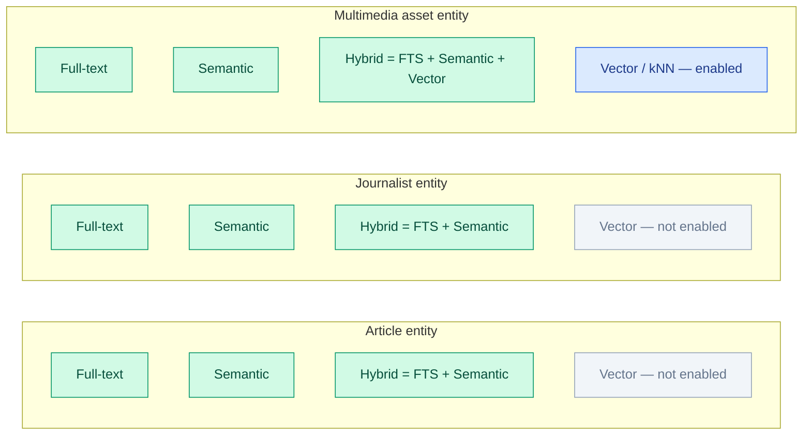
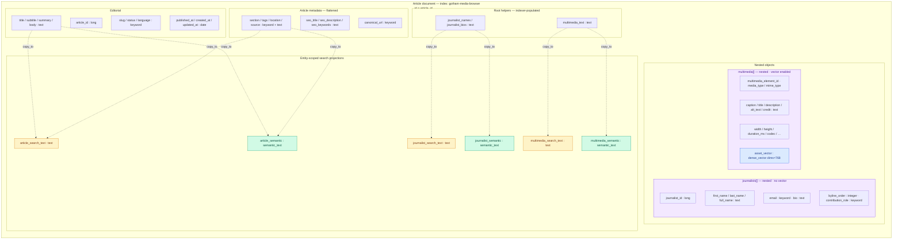
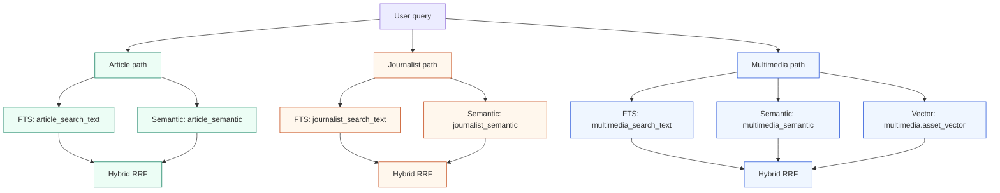
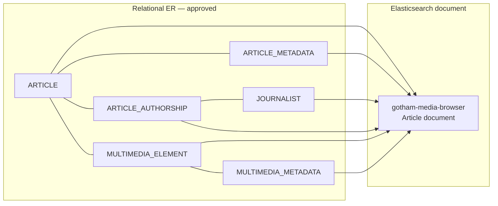
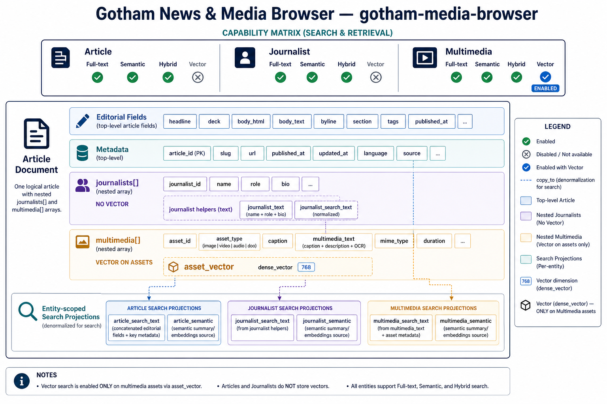

# Gotham News & Media Browser — Denormalized Model Diagram

**Index:** `gotham-media-browser` (Elasticsearch 9.x)  
**Related:** [`elasticsearch-denormalized-model.md`](./elasticsearch-denormalized-model.md) · [`../elasticsearch/gotham-media-browser.mapping.json`](../elasticsearch/gotham-media-browser.mapping.json)

## Search capability matrix

## Document structure

## Search flows by entity

## Relational → denormalized mapping

## Legend

| Color / block | Meaning |
|---------------|---------|
| Article projections | FTS + semantic + hybrid only |
| Journalist projections | FTS + semantic + hybrid only |
| Multimedia projections | FTS + semantic + hybrid + **vector** (`asset_vector`) |
| `journalists[]` | Nested; no dense vector |
| `multimedia[]` | Nested; owns the only explicit `dense_vector` |

Static SVG export: [`../diagrams/gotham-media-browser-denormalized.svg`](../diagrams/gotham-media-browser-denormalized.svg)  
Rendered overview image: [`../diagrams/gotham-media-browser-es-model.png`](../diagrams/gotham-media-browser-es-model.png)

