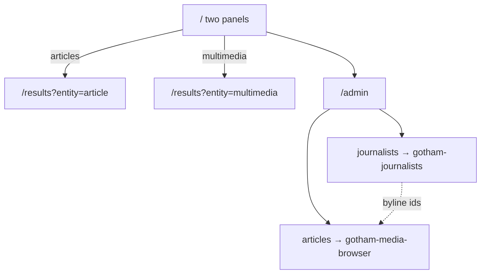

# Gotham News & Media Browser — Frontend Information Architecture

**UI:** Thymeleaf (server-rendered)  
**Related:** [`architecture-components.md`](./architecture-components.md) · [`ui-design-search-results.md`](./ui-design-search-results.md)  
**Mockups:** [`../ui-mockups/`](../ui-mockups/)

## Route map

| Route | Purpose |
|-------|---------|
| `GET /` | Landing — **two panels**: article search + multimedia search |
| `GET /results` | Results — filters, sorting, pagination |
| `GET /articles/{id}` | Article detail (`{id}` = ES article `_id`) |
| `GET /admin` | Admin hub |
| `/admin/journalists/**` | Journalist CRUD → index `gotham-journalists` |
| `/admin/articles/**` | Article CRUD (+ metadata, status, media) → `gotham-media-browser` |

## Allowed search methods

| Panel | Full-text | Semantic | Hybrid | Vector |
|-------|:---------:|:--------:|:------:|:------:|
| Articles | ✓ | ✓ | ✓ | ✗ |
| Multimedia | ✓ | ✓ | ✓ | ✓ |

**No journalist search UI.** Article full-text accepts a **`journalist`** parameter (filter).

## 1. Landing (`/`) — two panels

```text
┌────────────────────────────┬────────────────────────────────┐
│  Articles                  │  Multimedia                    │
│  query + Full-text|       │  query + Full-text|Semantic|  │
│  Semantic|Hybrid           │  Hybrid|Vector (+ file)        │
│  → /results?entity=article │  → /results?entity=multimedia  │
└────────────────────────────┴────────────────────────────────┘
```

## 2. Results (`/results`)

### Params

| Param | Applies to | Description |
|-------|------------|-------------|
| `entity` | both | `article` \| `multimedia` |
| `q` | both | Text query |
| `mode` | both | `fulltext` \| `semantic` \| `hybrid` \| `vector` |
| `status` | article (+ optional multimedia via parent) | `DRAFT` \| `PUBLISHED` \| `ARCHIVED` (multi-select OK) |
| `journalist` | **article full-text** | Journalist ES `_id` or name (filter / FTS param) |
| `section` | both | Section facet |
| `mediaType` | multimedia | `IMAGE` \| `AUDIO` \| `VIDEO` |
| `language` | article | e.g. `en` |
| `from` / `to` | both | Date range on `published_at` |
| `sort` | both | `relevance` \| `published_at_desc` \| `published_at_asc` \| `title_asc` |
| `page` / `size` | both | Pagination |

- All three statuses are searchable; filter defaults can show all.  
- Ignore `mode=vector` when `entity=article`.  
- Multimedia hits should surface matched asset via inner hits / card UI.  
- Media URLs are **public GCS** HTTPS links (no signing).

## 3. Admin

### Journalists (`gotham-journalists`)
- CRUD on master journalist documents (ES auto `_id`)  
- Fields: first name, last name, email, bio  
- Delete: block if referenced by articles, or cascade-strip + reindex articles  

### Articles (`gotham-media-browser`)
- CRUD with **status**: DRAFT | PUBLISHED | ARCHIVED  
- Select journalists from `gotham-journalists`  
- Upload media within local limits; public GCS; ImageBind; nested on article  
- `{id}` in URLs is the article ES `_id`  

### Local upload limits (enforce in forms)
| IMAGE | 10 MiB |
| AUDIO | 20 MiB / 5 min |
| VIDEO | 50 MiB / 90 s |

## Wireflow


