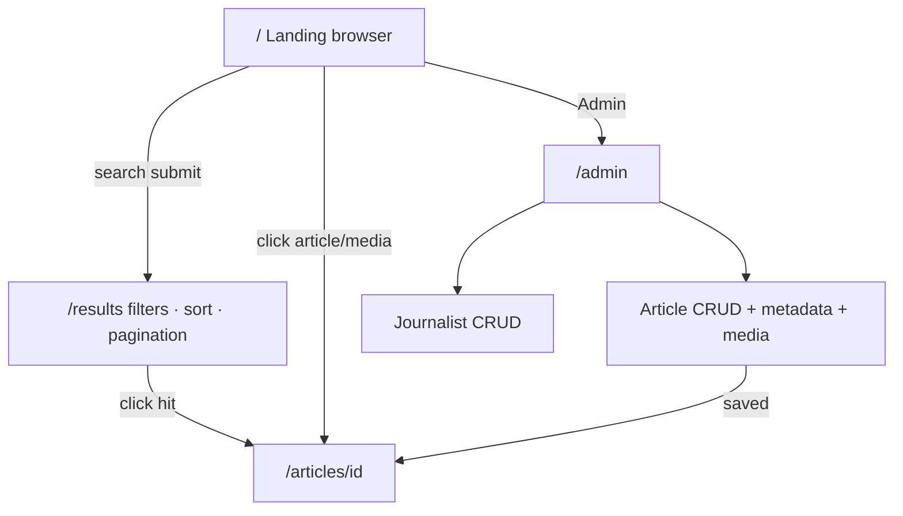

# Gotham News & Media Browser — Frontend Information Architecture

**UI:** Thymeleaf (server-rendered)  
**Auth:** None (prototype)  
**Related:** [`architecture-components.md`](./architecture-components.md)

## Route map

| Route | Purpose |
|-------|---------|
| `GET /` | **Landing** — articles & multimedia browser |
| `GET /search` | Search form entry (optional; landing may host the search box) |
| `GET /results` | **Results page** — filters, sorting, pagination |
| `GET /articles/{id}` | Article detail (byline, body, nested multimedia) |
| `GET /admin` | Admin hub |
| `GET\|POST /admin/journalists` | Journalist list + create |
| `GET\|POST /admin/journalists/{id}` | Journalist edit / update |
| `POST /admin/journalists/{id}/delete` | Journalist delete |
| `GET\|POST /admin/articles` | Article list + create (incl. metadata + media upload) |
| `GET\|POST /admin/articles/{id}` | Article edit / update |
| `POST /admin/articles/{id}/delete` | Article delete |
| `POST /admin/articles/{id}/media` | Add multimedia to article |
| `POST /admin/articles/{id}/media/{mediaId}/delete` | Remove multimedia |

All admin routes live under **`/admin`**. Public browsing stays at `/` and `/results`.

## 1. Landing — articles & multimedia browser (`/`)

**Job:** First viewport for discovery. Brand + primary browse/search experience.

### Layout (sections)
1. **Header** — product name *Gotham News & Media Browser*, link to Admin  
2. **Search bar** — query input; mode tabs: Full-text | Semantic | Hybrid | Vector  
   - Vector tab enables media-file upload for the query (multimedia search)  
3. **Browse strips**
   - Latest / featured **articles** (cards: title, summary, section, byline, hero thumb)
   - Featured **multimedia** (image/audio/video tiles linking to parent article)
4. **Quick filters** (optional chips) — section, media type — submitting navigates to `/results`

### Landing interactions
- Submit search → `GET /results?q=…&mode=…`  
- Click article → `/articles/{id}`  
- Click media tile → `/articles/{id}` focused on that asset (anchor / fragment)

## 2. Results page (`/results`)

**Job:** Present **all** search hits with **filters**, **sorting**, and **pagination**. UX priority.

### Query parameters (canonical)

| Param | Description |
|-------|-------------|
| `q` | Text query |
| `mode` | `fulltext` \| `semantic` \| `hybrid` \| `vector` |
| `entity` | `all` \| `article` \| `journalist` \| `multimedia` (default `all` or `article`) |
| `section` | Facet filter |
| `mediaType` | `IMAGE` \| `AUDIO` \| `VIDEO` |
| `language` | e.g. `en` |
| `from` / `to` | `published_at` range |
| `sort` | `relevance` \| `published_at_desc` \| `published_at_asc` \| `title_asc` |
| `page` | 1-based page index |
| `size` | page size (e.g. 10 / 20 / 50) |
| `media` | multipart reserved for vector mode (POST variant if needed) |

Vector mode may use `POST /results` when a media file is uploaded.

### Page chrome
1. **Sticky search header** — same tabs as landing; current `mode` selected  
2. **Left / top filter panel**
   - Entity type  
   - Section  
   - Media type  
   - Date range  
   - Language  
3. **Sort control** — relevance (default for search), date, title  
4. **Result list**
   - Article hits: title, summary snippet, section, byline, date, score (optional)  
   - Journalist hits: name, bio snippet, link to articles by that journalist  
   - Multimedia hits: thumb/player chrome, caption, parent article link, media type badge  
5. **Pagination** — page numbers + prev/next; preserve all filters/sort/mode in links  
6. **Empty / error states** — clear messaging + reset filters

### Results UX rules
- Changing filter, sort, mode, or page **reloads** `/results` with updated query string (progressive enhancement; no SPA required).  
- Snippets highlight matched terms for full-text mode when ES highlight is available.  
- Hybrid/semantic/vector show relevance ordering by default (`sort=relevance`).  
- Pagination always available when `totalHits > size`.

## 3. Article detail (`/articles/{id}`)

- Full editorial body, metadata, journalist bylines  
- Embedded / listed multimedia (signed or public GCS URLs as configured)  
- “Search similar” affordance → `/results` in semantic/vector mode (optional stretch)

## 4. Admin (`/admin`) — CRUD

**Job:** Manage journalists and articles (with metadata and multimedia), without public-site chrome clutter.

### Admin hub (`GET /admin`)
- Cards/links: Manage Journalists · Manage Articles  
- Short counts from ES (optional)

### Journalists CRUD
| Operation | Behavior |
|-----------|----------|
| **List** | Table: name, email, updated_at; actions Edit / Delete |
| **Create** | Form: first name, last name, email, bio (+ standard timestamps server-side) |
| **Update** | Same fields; on save → re-embed journalist text via ImageBind → reindex affected article docs (or journalist projection strategy as implemented) |
| **Delete** | Confirm; block or cascade policy: prototype may forbid delete if referenced by articles, or strip authorship and reindex |

### Articles CRUD (incl. metadata & media)
| Operation | Behavior |
|-----------|----------|
| **List** | Table: title, section, status, published_at; actions Edit / Delete |
| **Create / Update** | Fields: title, subtitle, summary, body, slug, status, language, section, tags, location, source, SEO fields; multi-select journalists + byline order/role |
| **Multimedia** | Upload image/audio/video → GCS → ImageBind → nested `multimedia` on article doc |
| **Delete** | Confirm; delete ES doc + GCS objects for attached media |

Admin forms use PRG (post/redirect/get) and validation error redisplay via Thymeleaf.

## Sitemap (logical)

```text
/                          Landing browser
├── /results               Search results (filter · sort · paginate)
├── /articles/{id}         Article detail
└── /admin                 Admin hub
    ├── /journalists       Journalist CRUD
    └── /articles          Article CRUD (+ metadata + media)
```

## Wireflow



## Non-goals (frontend)
- SPA frameworks  
- Login / roles on `/admin` (prototype open admin)  
- Infinite scroll as the only navigation (pagination is required)  
