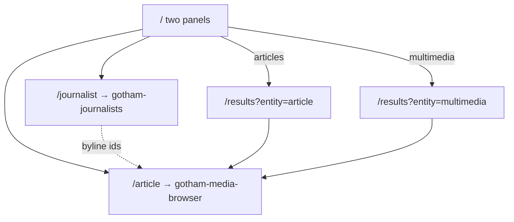

# Gotham News & Media Browser — Frontend Information Architecture

**UI:** Thymeleaf (server-rendered)  
**Implementation (2026-09-08):** P3–P8 live — CRUD, full-text, semantic (kNN), hybrid (RRF), and multimedia file→vector search all ship.  
**Related:** [`architecture-components.md`](./architecture-components.md) · [`ui-design-search-results.md`](./ui-design-search-results.md) · [`ui-design-crud.md`](./ui-design-crud.md) · [`ui-design-errors.md`](./ui-design-errors.md) · [`elasticsearch-search-methods.md`](./elasticsearch-search-methods.md)  
**Mockups:** [`../ui-mockups/`](../ui-mockups/)

## Route map

| Route | Purpose |
|-------|---------|
| `GET /` | Landing — **two panels**: article search + multimedia search |
| `GET /results` | Results — filters, sorting, pagination; full-text · semantic · hybrid modes |
| `POST /results` | Multipart — multimedia `mode=vector` posts a file (classify → ImageBind → nested kNN) |
| `GET /journalist` | List journalists (`gotham-journalists`) |
| `GET /journalist/new` | Create journalist form |
| `GET /journalist/{id}` | Edit journalist (`{id}` = ES `_id`) |
| `POST /journalist` | Create journalist |
| `POST /journalist/{id}` | Update journalist |
| `POST /journalist/{id}/delete` | Delete journalist (**cascade-strip** nested bylines on articles, then delete master) |
| `GET /article` | List articles (`gotham-media-browser`) |
| `GET /article/new` | Create article form (denormalized doc) |
| `GET /article/{id}` | Edit / view article (`{id}` = ES `_id`) |
| `POST /article` | Create article (+ nest journalists, upload media) |
| `POST /article/{id}` | Update article |
| `POST /article/{id}/delete` | Delete article (+ GCS objects) |

No `/admin` hub. CRUD lives on **`/journalist`** and **`/article`** only.

## Allowed search methods

| Panel | Full-text | Semantic | Hybrid | Vector |
|-------|:---------:|:--------:|:------:|:------:|
| Articles | ✓ | ✓ | ✓ | ✗ |
| Multimedia | ✓ | ✓ | ✓ | ✓ |

**No journalist search UI** on the public landing. Journalist master data is managed only via `/journalist`.  
Article full-text search still accepts a **`journalist`** filter parameter.  
**Full-text attribute checkboxes:** denormalized ES text attributes.  
**Chrome:** shared header + footer (Thymeleaf fragments); ImageBind + Elasticsearch availability legends (`/api/health/*`); footer © 2020 Packt · © 2026 · MIT.  
**Fault tolerance:** unexpected failures on **any** endpoint render a branded error page with a clear **reason** (see [`ui-design-errors.md`](./ui-design-errors.md)); expected validation stays on forms. Empty `q` on `/results` stays on the results page with a query message. Article `mode=vector` → HTTP 400 branded page.

**Implementation (2026-09-08):** all four search modes are live on `/results` — full-text, semantic (kNN), hybrid (RRF), and multimedia vector (uploaded file). Article `mode=vector` returns an HTTP 400 branded page.

## Error & recovery

| Outcome | UX |
|---------|-----|
| Field validation | Re-show form with messages |
| Not found / bad route | `404` error page + reason |
| Dependency down (ES, ImageBind, GCS) | `503` error page naming the service |
| Media over limit | `413` error page or form message |
| Unexpected exception | `500` error page + sanitized reason + reference id |

Whitelabel errors are disabled. Server logs keep the full stack keyed by reference id.

```text
┌────────────────────────────┬────────────────────────────────┐
│  Articles                  │  Multimedia                    │
│  query + Full-text|       │  query + Full-text|Semantic|  │
│  Semantic|Hybrid           │  Hybrid|Vector (+ file)        │
│  → /results?entity=article │  → /results?entity=multimedia  │
└────────────────────────────┴────────────────────────────────┘
```

## 2. Results (`/results`)

### Params

| Param | Applies to | Description |
|-------|------------|-------------|
| `entity` | both | `article` \| `multimedia` |
| `q` | both | Text query |
| `mode` | both | `fulltext` \| `semantic` \| `hybrid` \| `vector` |
| `fields` | full-text | Multi-select denormalized text attributes (see UI design doc) |
| `status` | article (+ optional multimedia via parent) | `DRAFT` \| `PUBLISHED` \| `ARCHIVED` (multi-select OK) |
| `journalist` | **article full-text** | Journalist ES `_id` or name (filter / FTS param) |
| `section` | both | Section facet |
| `mediaType` | multimedia | `IMAGE` \| `AUDIO` \| `VIDEO` |
| `language` | article | e.g. `en` |
| `published_from` / `published_to` | both | Date range on `published_at` (not ES `from`) |
| `sort` | both | `relevance` \| `published_at_desc` \| `published_at_asc` \| `title_asc` |
| `page` | both | 1-based page index |
| `size` | both | **25** \| **50** \| **100** → Elasticsearch `size` |

### Pagination ↔ Elasticsearch
```text
from = (page - 1) * size
size = size ∈ {25, 50, 100}
track_total_hits = true
```
Total page count = `ceil(hits.total.value / size)`. Changing `size` resets `page` to `1`.

- All three statuses are searchable; filter defaults can show all.  
- Ignore is **not** acceptable for `mode=vector` when `entity=article` — reject with **HTTP 400** and the branded error page (“Vector search is only available for multimedia.”).  
- Multimedia hits should surface matched asset via inner hits / card UI.  
- Media URLs are **public GCS** HTTPS links (no signing).  
- Multimedia results render with **HTML5** `` / `<audio controls>` / `<video controls>`.

## 3. Journalist CRUD (`/journalist`) → `gotham-journalists`

| Field | Notes |
|-------|--------|
| `first_name`, `last_name` | Required; `full_name` derived on write |
| `email` | Keyword, unique in app validation |
| `bio` | Optional text |
| `_id` | Elasticsearch auto-id (read-only in UI) |

Delete: **cascade-strip** — remove this `journalist_id` from all nesting articles, rebuild journalist projections, reindex those articles, then delete the `gotham-journalists` document.

## 4. Article CRUD (`/article`) → `gotham-media-browser`

Denormalized document form covers:

- Core: title, subtitle, summary, body, slug, status, language, published_at  
- Metadata: section, tags, location, source, seo_*, canonical_url  
- Nested **journalists[]**: pick from `gotham-journalists` (`journalist_id`, byline_order, contribution_role ∈ `AUTHOR` \| `CO_AUTHOR` \| `CONTRIBUTING`); snapshot names/bio/email at write  
- Nested **multimedia[]**: upload IMAGE/AUDIO/VIDEO within local limits; title/caption/alt/credit on the form and via datagen `newMedia*` fields; app-assigned `multimedia_element_id`; public GCS `storage_uri`; ImageBind `asset_vector`  
- Projections refreshed on write: `journalist_*`, `multimedia_*`, `article_search_text`, `article_embedding`

Full-text UI checkbox values such as `section` / `tags` / `location` / `source` are remapped by the backend to analyzable `*.text` subfields (keyword parents keep exact filters/facets).

### Local upload limits
| IMAGE | 10 MiB |
| AUDIO | 20 MiB / 5 min |
| VIDEO | 50 MiB / 90 s |

## Wireflow


