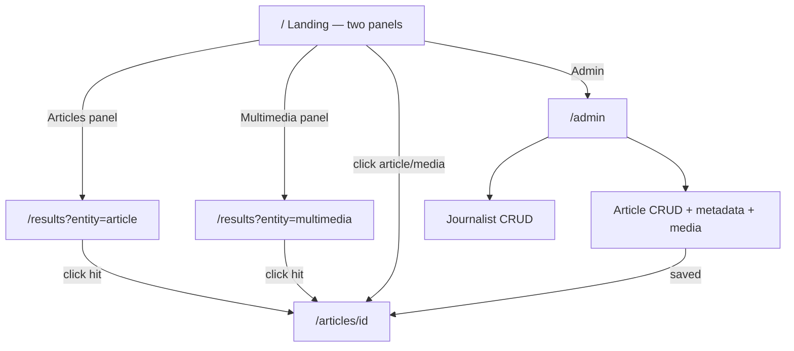

# Gotham News & Media Browser — Frontend Information Architecture

**UI:** Thymeleaf (server-rendered)  
**Auth:** None (prototype)  
**Related:** [`architecture-components.md`](./architecture-components.md)

## Route map

| Route | Purpose |
|-------|---------|
| `GET /` | **Landing** — dual panels: article search + multimedia search |
| `GET /results` | **Results** — entity-scoped hits with filters, sorting, pagination |
| `GET /articles/{id}` | Article detail (byline, body, nested multimedia) |
| `GET /admin` | Admin hub |
| `GET\|POST /admin/journalists` | Journalist list + create |
| `GET\|POST /admin/journalists/{id}` | Journalist edit / update |
| `POST /admin/journalists/{id}/delete` | Journalist delete |
| `GET\|POST /admin/articles` | Article list + create (incl. metadata + media upload) |
| `GET\|POST /admin/articles/{id}` | Article edit / update |
| `POST /admin/articles/{id}/delete` | Article delete |
| `POST /admin/articles/{id}/media` | Add multimedia to article |
| `POST /admin/articles/{id}/media/{mediaId}/delete` | Remove multimedia |

All admin routes live under **`/admin`**. Public browsing stays at `/` and `/results`.

## Allowed search methods (authoritative)

| Target | Full-text | Semantic | Hybrid | Vector |
|--------|:---------:|:--------:|:------:|:------:|
| **Articles** (landing panel 1) | ✓ | ✓ | ✓ | ✗ |
| **Multimedia** (landing panel 2) | ✓ | ✓ | ✓ | ✓ |

## 1. Landing — two search panels (`/`)

**Job:** First viewport. Two panels so users search **articles** and **multimedia** separately, each with only the methods allowed for that target.

### Layout
1. **Header** — *Gotham News & Media Browser*, link to Admin  
2. **Two-panel search workspace** (side-by-side on desktop; stacked on narrow viewports)

```text
┌─────────────────────────────────────────────────────────────┐
│  Gotham News & Media Browser                    [Admin]     │
├────────────────────────────┬────────────────────────────────┤
│  Panel 1: Articles         │  Panel 2: Multimedia           │
│  [ search query        ]   │  [ search query            ]   │
│  Full-text | Semantic |    │  Full-text | Semantic |        │
│  Hybrid                    │  Hybrid | Vector               │
│                            │  [ choose file ] (if Vector)   │
│  [ Search articles ]       │  [ Search multimedia ]         │
└────────────────────────────┴────────────────────────────────┘
│  optional: latest articles  ·  featured multimedia           │
└─────────────────────────────────────────────────────────────┘
```

3. Optional **browse strips** under the panels (latest articles / featured media) for discovery only

### Panel 1 — Article search
- Text query input  
- Methods: **Full-text | Semantic | Hybrid** only  
- No file upload, no Vector control  
- Submit → `GET /results?entity=article&q=…&mode=fulltext|semantic|hybrid`

### Panel 2 — Multimedia search
- Text query input (Full-text / Semantic / Hybrid)  
- Methods: **Full-text | Semantic | Hybrid | Vector**  
- Vector selected → show image/audio/video file picker for the query asset  
- Submit → `GET /results?entity=multimedia&q=…&mode=…`  
- Vector + file → `POST /results` (`entity=multimedia`, `mode=vector`, multipart)

### Landing interactions
- Each panel always sets its own `entity` (`article` or `multimedia`).  
- Click browse article → `/articles/{id}`  
- Click browse media → `/articles/{id}` focused on that asset (fragment)

## 2. Results page (`/results`)

**Job:** Present search hits for the **selected entity** with **filters**, **sorting**, and **pagination**.

### Query parameters (canonical)

| Param | Description |
|-------|-------------|
| `entity` | `article` \| `multimedia` (from landing panel; required) |
| `q` | Text query |
| `mode` | `fulltext` \| `semantic` \| `hybrid` \| `vector` |
| `section` | Facet filter |
| `mediaType` | `IMAGE` \| `AUDIO` \| `VIDEO` (multimedia entity) |
| `language` | e.g. `en` (article entity) |
| `from` / `to` | `published_at` range |
| `sort` | `relevance` \| `published_at_desc` \| `published_at_asc` \| `title_asc` |
| `page` | 1-based page index |
| `size` | page size (e.g. 10 / 20 / 50) |

Reject or ignore `mode=vector` when `entity=article`.

### Page chrome
1. **Sticky search header** — methods for the **current entity only**  
   - `entity=article` → Full-text | Semantic | Hybrid  
   - `entity=multimedia` → Full-text | Semantic | Hybrid | Vector (+ file when Vector)  
2. **Filter panel** (entity-appropriate)  
   - Article: section, language, date range  
   - Multimedia: media type, parent section, date range  
3. **Sort control** — relevance (default), date, title  
4. **Result list** (scoped to `entity`)  
   - Articles: title, summary snippet, section, byline, date  
   - Multimedia: thumb/player, caption, type badge, parent article link  
5. **Pagination** — preserve `entity`, mode, filters, sort in every link  
6. **Empty / error states** — clear messaging + reset  

Optional: link “Search multimedia instead” / “Search articles instead” back to the other landing panel.

### Results UX rules
- Changing filter, sort, mode, or page reloads `/results` with an updated query string (no SPA required).  
- Full-text may use ES highlighting when available.  
- Semantic / hybrid / vector default to `sort=relevance`.  
- Pagination whenever `totalHits > size`.

## 3. Article detail (`/articles/{id}`)

- Full body, metadata, journalist bylines  
- Listed / embedded multimedia (GCS URLs as configured)  
- Optional “similar” → `/results` semantic or vector (stretch)

## 4. Admin (`/admin`) — CRUD

**Job:** Manage journalists and articles (metadata + multimedia).

### Admin hub (`GET /admin`)
- Links: Manage Journalists · Manage Articles  

### Journalists CRUD
| Operation | Behavior |
|-----------|----------|
| **List** | name, email, updated_at; Edit / Delete |
| **Create / Update** | first name, last name, email, bio; re-embed text via ImageBind; reindex affected docs |
| **Delete** | Confirm; block if referenced, or strip authorship and reindex |

### Articles CRUD
| Operation | Behavior |
|-----------|----------|
| **List** | title, section, status, published_at; Edit / Delete |
| **Create / Update** | editorial fields, metadata, SEO, journalist multi-select + roles |
| **Multimedia** | Upload → GCS → ImageBind → nested `multimedia` on article |
| **Delete** | Confirm; delete ES doc + GCS objects |

Admin uses PRG and Thymeleaf validation redisplay.

## Sitemap

```text
/                          Landing — dual search panels
├── /results               Entity-scoped results (filter · sort · paginate)
├── /articles/{id}         Article detail
└── /admin                 Admin hub
    ├── /journalists       Journalist CRUD
    └── /articles          Article CRUD (+ metadata + media)
```

## Wireflow



## Non-goals (frontend)
- SPA frameworks  
- Login / roles on `/admin`  
- Infinite scroll as sole navigation (pagination required)  
- Vector search UI on the articles panel  
