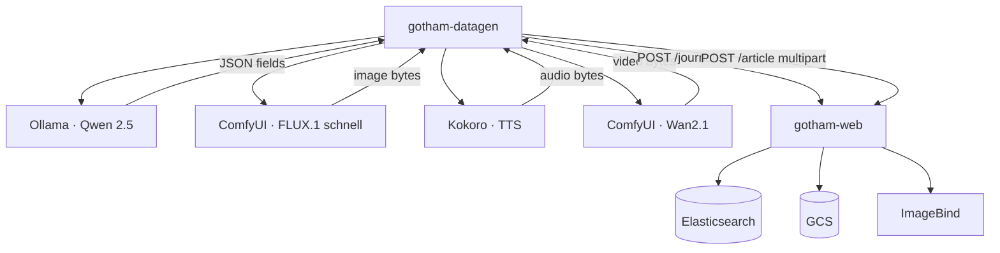

# Synthetic Data Generation

**Module:** `gotham-datagen` (Maven, last implementation phase **P10**)  
**Purpose:** Generate realistic journalists + denormalized articles (with IMAGE / AUDIO / VIDEO) and load them **through** the live CRUD APIs (`POST /journalist`, `POST /article`).  
**Related:** [`implementation-plan.md`](./implementation-plan.md) · [`architecture-end-to-end.md`](./architecture-end-to-end.md) · [`ui-design-crud.md`](./ui-design-crud.md)

---

## 1. Role in the prototype

| Concern | Decision |
|---------|----------|
| When | **Last phase (P10)** — after CRUD, media, embeddings, and search work |
| How data enters the system | **Only via HTTP** to `/journalist` and `/article` (exercises validation, GCS, ImageBind, projections) |
| Not allowed | Writing straight to Elasticsearch / GCS while bypassing the app (except debugging) |
| CI / smoke | Keep **P9** minimal static fixtures; **P10** is GPU/model-backed and optional on low-VRAM hosts |

---

## 2. Maven module

```text
gotham-datagen/          # Spring Boot CLI / CommandLineRunner (or @SpringBootApplication with web disabled)
  pom.xml                # depends on gotham-common (DTOs/clients optional); HTTP client to gotham-web
  src/.../DatagenApplication.java
```

- Package: `com.gotham.newsmediabrowser.datagen`  
- Runnable: `mvn -pl gotham-datagen spring-boot:run -Dspring-boot.run.arguments="--journalists=5 --articles=10"`  
- Parent POM lists `gotham-datagen` as a module (IntelliJ shows three app modules: common, web, datagen).

---

## 3. Helper services (modality generators)

Orchestrator calls these **over HTTP**. Images below are the locked prototype defaults:

| Modality | Best model | Size / quant | VRAM (approx.) | Recommended Docker image | Typical API use |
|----------|------------|--------------|----------------|--------------------------|-----------------|
| **Text** | Qwen 2.5 (14B-Instruct) | 14B (Q4_K_M or Q5_K_M) | ~9–11 GB | `ollama/ollama:latest` | Chat/completions → names, bios, titles, summaries, bodies, metadata, captions |
| **Image** | FLUX.1 [schnell] | 12B (NF4 / Q4 GGUF) | ~11–13 GB | `yanwk/comfyui-boot` | T2I workflow → JPEG/PNG bytes for `IMAGE` multimedia |
| **Audio / voice** | Kokoro-82M | 82M (FP16 / ONNX) | ~0.5 GB (or 0 on CPU) | `ghcr.io/remsky/kokoro-fastapi-cpu` | TTS → WAV/MP3 for `AUDIO` multimedia |
| **Video** | Wan2.1 (T2V-1.3B) | 1.3B (BF16 / FP8) | ~9–12 GB (CPU offload OK) | `yanwk/comfyui-boot` | T2V workflow → short MP4 within **90 s / 50 MiB** limit |

### Compose profile `datagen`

```text
services (profile: datagen):
  ollama                 # Qwen 2.5 14B — pull model on first run
  comfyui                # FLUX.1 [schnell] + Wan2.1 workflows
  kokoro                 # Kokoro-82M TTS (CPU image OK)

always on (existing):
  gotham-web
  imagebind-service
```

`gotham-datagen` reads base URLs from `application.properties` (hardcoded placeholders, same pattern as other services):

```properties
gotham.datagen.web-base-url=http://localhost:8080
gotham.datagen.ollama-base-url=http://localhost:11434
gotham.datagen.comfyui-base-url=http://localhost:8188
gotham.datagen.kokoro-base-url=http://localhost:8880
gotham.datagen.journalists=5
gotham.datagen.articles=10
gotham.datagen.media-per-article=1
```

---

## 4. Generation pipeline



### Steps (per run)

1. **Health-check** helper services + `gotham-web` (fail with clear CLI error if down — no silent skip of modalities unless `--skip-video` etc.).  
2. **Journalists:** Qwen produces `first_name`, `last_name`, `email`, `bio` → `POST /journalist` → collect returned `_id`s.  
3. **Articles:** For each article, Qwen produces story + metadata + byline selection among created ids + `contribution_role` ∈ {AUTHOR, CO_AUTHOR, CONTRIBUTING} + `status`.  
4. **Multimedia (optional counts):**  
   - Prompt Qwen for image/audio/video captions aligned to the article  
   - FLUX → image file (≤ 10 MiB)  
   - Kokoro → audio file (≤ 20 MiB / 5 min)  
   - Wan2.1 → video file (≤ 50 MiB / **90 s**)  
5. **POST `/article`** with multipart fields matching the CRUD form contract.  
6. Rely on **gotham-web** for GCS upload, ImageBind embeddings, projections, and indexing.  
7. Print a summary report (ids created, failures with reasons).

Respect media limits and fault-tolerant UX: HTTP error bodies from `/article` should be surfaced in the CLI log (reference id if present).

---

## 5. Content constraints

- Language default `en`; Gotham / civic-news tone.  
- Every article ≥ 1 journalist.  
- Status mix: include DRAFT, PUBLISHED, and at least one ARCHIVED across a full run.  
- Tags/section/location/source/seo_*/canonical_url populated when Qwen returns them.  
- Do not invent ES `_id`s client-side for journalists/articles — use API responses.  
- `multimedia_element_id` remains **app-assigned** inside `gotham-web`.

---

## 6. Failure & skip policy

| Condition | Behavior |
|-----------|----------|
| Ollama / Qwen unavailable | Abort run (text is required) |
| Kokoro unavailable | Continue without AUDIO if `--skip-audio`; else fail |
| ComfyUI / FLUX unavailable | Continue without IMAGE if `--skip-image`; else fail |
| ComfyUI / Wan unavailable | Continue without VIDEO if `--skip-video`; else fail |
| `gotham-web` 4xx/5xx | Log reason + reference id; fail that item; continue or `--fail-fast` |
| VRAM OOM | Document retry with stronger quant / CPU offload; do not corrupt partial ES docs mid-article (prefer fail before POST) |

---

## 7. Out of scope

- Training or fine-tuning models  
- Replacing ImageBind (still required on write path inside `gotham-web`)  
- Public UI for datagen (CLI / Maven module only)  
- Committing generated binaries to git  

---

## 8. Open questions (human)

| # | Question | Default until answered |
|---|----------|------------------------|
| D1 | Lab GPU VRAM available for Ollama + ComfyUI (often **≥12 GB** for FLUX/Wan; Qwen 14B Q4 ~10 GB)? | Document requirements; allow `--skip-image` / `--skip-video` on small GPUs |
| D2 | Default volumes per run? | **5** journalists · **10** articles · **1** media asset per article (rotating IMAGE/AUDIO/VIDEO) |
| D3 | Confirm **Maven module** `gotham-datagen` (not a separate Python repo)? | **Yes** — Java orchestrator + Docker helpers |
| D4 | Should P9 static seed remain for CI without GPU? | **Yes** — tiny fixtures; P10 is full synthetic |

---

## 9. Validation checklist (design)

| Check | Result |
|-------|--------|
| Module is **last** phase (**P10**) after P9 smoke | ✓ in plan + state |
| Data enters only via `/journalist` and `/article` | ✓ |
| Helper table matches operator models / images | ✓ Qwen · FLUX · Kokoro · Wan |
| Compose profile `datagen` separate from always-on web/ImageBind | ✓ |
| Media limits align with ImageBind CPU caps | ✓ |
| P9 static fixtures kept for no-GPU CI | ✓ |
| ImageBind still used on write path inside `gotham-web` | ✓ (datagen does not replace it) |
| Plan/state task count includes P10 (41 total) | ✓ |
