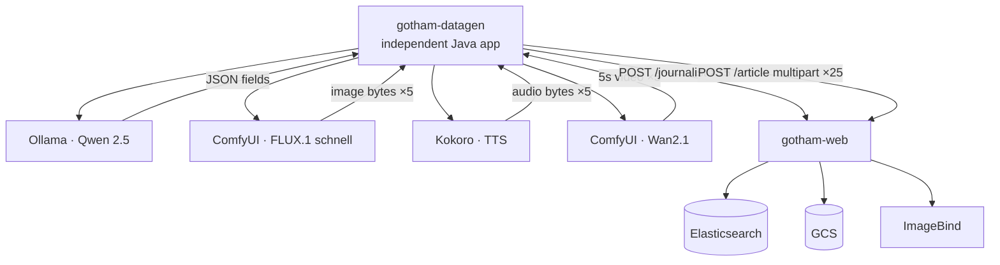

# Synthetic Data Generation

**Module:** `gotham-datagen` (Maven, last implementation phase **P10**)  
**Purpose:** Generate realistic journalists + denormalized articles (with IMAGE / AUDIO / VIDEO) and load them **through** the live CRUD APIs (`POST /journalist`, `POST /article`).  
**Related:** [`implementation-plan.md`](./implementation-plan.md) · [`architecture-end-to-end.md`](./architecture-end-to-end.md) · [`ui-design-crud.md`](./ui-design-crud.md)

---

## 1. Role in the prototype

| Concern | Decision |
|---------|----------|
| When | **Last phase (P10)** — after CRUD, media, embeddings, and search work |
| How data enters the system | **Only via HTTP** to `/journalist` and `/article` (exercises validation, GCS, ImageBind, projections) |
| Not allowed | Writing straight to Elasticsearch / GCS while bypassing the app (except debugging) |
| Runtime shape | **Independent Java application** in the multi-module Maven project (own main class / fat jar — **not** embedded inside `gotham-web`) |
| CI / smoke | Keep **P9** minimal static fixtures; **P10** is model-backed full synthetic load |

---

## 2. Independent Java application (`gotham-datagen`)

```text
gotham-datagen/          # standalone Spring Boot app (web disabled / none)
  pom.xml                # depends on gotham-common; HTTP client to gotham-web + helpers
  src/.../DatagenApplication.java   # @SpringBootApplication — own process
```

| Rule | Detail |
|------|--------|
| Packaging | Maven module with `spring-boot-maven-plugin` executable jar |
| Process | Runs **separately** from `gotham-web` (different JVM / Compose service or `mvn -pl gotham-datagen spring-boot:run`) |
| Not | A library called in-process by `gotham-web`, and not a Python-only repo |
| Package | `com.gotham.newsmediabrowser.datagen` |
| Parent POM | Lists `gotham-datagen` alongside `gotham-common` and `gotham-web` (IntelliJ: three runnable/app modules + shared common) |

Example:

```bash
mvn -pl gotham-datagen spring-boot:run
# or after package:
java -jar gotham-datagen/target/gotham-datagen-*.jar
```

---

## 3. Helper services (modality generators)

Orchestrator calls these **over HTTP**. Images below are the locked prototype defaults:

| Modality | Best model | Size / quant | VRAM (approx.) | Recommended Docker image | Typical API use |
|----------|------------|--------------|----------------|--------------------------|-----------------|
| **Text** | Qwen 2.5 (14B-Instruct) | 14B (Q4_K_M or Q5_K_M) | ~9–11 GB | `ollama/ollama:latest` | Chat/completions → names, bios, titles, summaries, bodies, metadata, captions |
| **Image** | FLUX.1 [schnell] | 12B (NF4 / Q4 GGUF) | ~11–13 GB | `yanwk/comfyui-boot` | T2I workflow → JPEG/PNG bytes for `IMAGE` multimedia |
| **Audio / voice** | Kokoro-82M | 82M (FP16 / ONNX) | ~0.5 GB (or 0 on CPU) | `ghcr.io/remsky/kokoro-fastapi-cpu` | TTS → WAV/MP3 for `AUDIO` multimedia |
| **Video** | Wan2.1 (T2V-1.3B) | 1.3B (BF16 / FP8) | ~9–12 GB (CPU offload OK) | `yanwk/comfyui-boot` | T2V → **5-second** MP4 clips (within 90 s / 50 MiB product limit) |

### Compose profile `datagen`

```text
services (profile: datagen):
  ollama                 # Qwen 2.5 14B — pull model on first run
  comfyui                # FLUX.1 [schnell] + Wan2.1 workflows
  kokoro                 # Kokoro-82M TTS (CPU image OK)

always on (existing):
  gotham-web
  imagebind-service

optional (P10):
  gotham-datagen         # independent Java app; or run from host/IDE against Compose helpers
```

`gotham-datagen` reads base URLs and volumes from `application.properties` (hardcoded placeholders, same pattern as other services):

```properties
gotham.datagen.web-base-url=http://localhost:8080
gotham.datagen.ollama-base-url=http://localhost:11434
gotham.datagen.comfyui-base-url=http://localhost:8188
gotham.datagen.kokoro-base-url=http://localhost:8880
gotham.datagen.journalists=15
gotham.datagen.articles=25
gotham.datagen.images-per-article=5
gotham.datagen.audios-per-article=5
gotham.datagen.videos-per-article=5
gotham.datagen.video-duration-seconds=5
```

---

## 4. Locked default volumes (per full run)

| Entity / asset | Count |
|----------------|------:|
| Journalists | **15** |
| Articles | **25** |
| IMAGE per article | **5** |
| AUDIO (voice) per article | **5** |
| VIDEO per article | **5** (each **5 seconds**) |
| Media assets total | **375** (= 25 × 15) |

Operators may override via CLI flags / properties; these are the prototype defaults.

---

## 5. Generation pipeline



### Steps (per run)

1. **Health-check** helper services + `gotham-web` (fail with clear CLI error if down — no silent skip of modalities unless `--skip-video` etc.).  
2. **Journalists (15):** Qwen produces `first_name`, `last_name`, `email`, `bio` → `POST /journalist` → collect returned `_id`s.  
3. **Articles (25):** For each article, Qwen produces story + metadata + byline selection among created ids + `contribution_role` ∈ {AUTHOR, CO_AUTHOR, CONTRIBUTING} + `status`.  
4. **Multimedia (per article):**  
   - Prompt Qwen for captions aligned to the article (5 image / 5 audio / 5 video captions)  
   - FLUX → **5** image files (each ≤ 10 MiB)  
   - Kokoro → **5** voice audio files (each ≤ 20 MiB / 5 min)  
   - Wan2.1 → **5** video clips, each **5 seconds** (≤ 50 MiB / 90 s product max)  
5. **POST `/article`** with multipart fields matching the CRUD form contract (all 15 assets, or create then attach via edit if the form contract is multi-step — prefer one write that leaves a complete denormalized doc).  
6. Rely on **gotham-web** for GCS upload, ImageBind embeddings, projections, and indexing.  
7. Print a summary report (ids created, failures with reasons).

Respect media limits and fault-tolerant UX: HTTP error bodies from `/article` should be surfaced in the CLI log (reference id if present).

**Operator note:** A full run embeds **375** media files through ImageBind on write — expect long wall-clock time on CPU-only ImageBind.

---

## 6. Content constraints

- Language default `en`; Gotham / civic-news tone.  
- Every article ≥ 1 journalist.  
- Status mix: include DRAFT, PUBLISHED, and at least one ARCHIVED across a full run.  
- Tags/section/location/source/seo_*/canonical_url populated when Qwen returns them.  
- Do not invent ES `_id`s client-side for journalists/articles — use API responses.  
- `multimedia_element_id` remains **app-assigned** inside `gotham-web`.  
- Video target duration for synthetic clips: **5 seconds** (not the product max of 90 s).

---

## 7. Failure & skip policy

| Condition | Behavior |
|-----------|----------|
| Ollama / Qwen unavailable | Abort run (text is required) |
| Kokoro unavailable | Continue without AUDIO if `--skip-audio`; else fail |
| ComfyUI / FLUX unavailable | Continue without IMAGE if `--skip-image`; else fail |
| ComfyUI / Wan unavailable | Continue without VIDEO if `--skip-video`; else fail |
| `gotham-web` 4xx/5xx | Log reason + reference id; fail that item; continue or `--fail-fast` |
| Helper OOM / resource exhaustion | Prefer fail **before** POST; do not leave half-built article docs mid-write |

---

## 8. Out of scope

- Training or fine-tuning models  
- Replacing ImageBind (still required on write path inside `gotham-web`)  
- Public UI for datagen (independent Java app / CLI only)  
- Committing generated binaries to git  

---

## 9. Locked decisions (human)

| # | Decision | Status |
|---|----------|--------|
| D2 | Volumes: **15** journalists · **25** articles · **5** IMAGE + **5** AUDIO + **5** VIDEO (5 s) per article | **Locked** |
| D3 | `gotham-datagen` is an **independent Java application** in the multi-module Maven project | **Locked** |
| D4 | P9 static seed remains for CI without generative helpers | **Locked** (default) |

| # | Still open | Notes |
|---|------------|-------|
| D1 | Hardware for image/video helpers | See operator question in PR / handoff — skip flags remain available |

---

## 10. Validation checklist (design)

| Check | Result |
|-------|--------|
| Module is **last** phase (**P10**) after P9 smoke | ✓ |
| Independent Java app in multi-module project | ✓ |
| Data enters only via `/journalist` and `/article` | ✓ |
| Helper table matches operator models / images | ✓ Qwen · FLUX · Kokoro · Wan |
| Default volumes 15 / 25 / 5+5+5 (5 s video) | ✓ |
| Compose profile `datagen` separate from always-on web/ImageBind | ✓ |
| Media limits align with ImageBind CPU caps; synthetic video = 5 s | ✓ |
| P9 static fixtures kept for no-GPU CI | ✓ |
| ImageBind still used on write path inside `gotham-web` | ✓ |
| Plan/state task count includes P10 (41 total) | ✓ |
