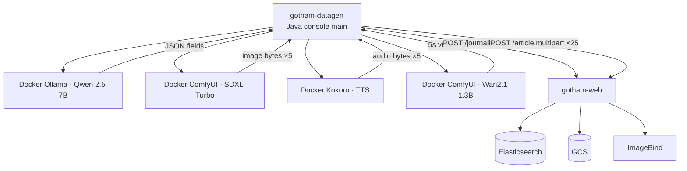

# Synthetic Data Generation

**Module:** `gotham-datagen` (Maven **Java console** app — **not** Spring Boot; last phase **P10**)  
**Purpose:** Generate realistic journalists + denormalized articles (with IMAGE / AUDIO / VIDEO) and load them **through** the live CRUD APIs (`POST /journalist`, `POST /article`).  
**Related:** [`implementation-plan.md`](./implementation-plan.md) · [`architecture-end-to-end.md`](./architecture-end-to-end.md) · [`ui-design-crud.md`](./ui-design-crud.md)

---

## 1. Role in the prototype

| Concern | Decision |
|---------|----------|
| When | **Last phase (P10)** — after CRUD, media, embeddings, and search work |
| How data enters the system | **Only via HTTP** to `/journalist` and `/article` (exercises validation, GCS, ImageBind, projections) |
| Not allowed | Writing straight to Elasticsearch / GCS while bypassing the app (except debugging) |
| Runtime shape | **Independent Java console application** (`main`) in the multi-module Maven project — **not** Spring Boot |
| Helper services | **Mandatory Docker containers** via Compose profile `datagen` (no native-host installs as the prototype path) |
| Target lab hardware | **MacBook Pro M4 · 32 GB unified memory · no NVIDIA GPU** |
| CI / smoke | Keep **P9** minimal static fixtures; **P10** is full synthetic load on the Mac |

---

## 2. Independent Java console application (`gotham-datagen`)

```text
gotham-datagen/          # plain Java console app (NOT Spring Boot)
  pom.xml                # jar module; depends on gotham-common; Java HTTP client(s)
  src/.../DatagenMain.java   # public static void main(String[] args)
```

| Rule | Detail |
|------|--------|
| Shape | **Console / CLI** Java application with a normal `main` entrypoint |
| Not Spring Boot | **No** `@SpringBootApplication`, **no** Spring Boot parent plugin on this module, **no** embedded Tomcat/web |
| Config | CLI args + optional `application.properties` / `.properties` file read manually (or env); same placeholder URL/volume keys as below |
| Packaging | Maven `jar` (optional `maven-shade-plugin` / `maven-jar-plugin` with `Main-Class` for fat/thin runnable jar) |
| Process | Runs **separately** from `gotham-web` (host/IDE JVM → Dockerized helpers + web over HTTP) |
| Package | `com.gotham.newsmediabrowser.datagen` |
| Parent POM | Lists `gotham-datagen` alongside `gotham-common` and `gotham-web` |

```bash
mvn -pl gotham-datagen -am package
java -jar gotham-datagen/target/gotham-datagen-*.jar
# or during dev:
mvn -pl gotham-datagen exec:java -Dexec.mainClass="com.gotham.newsmediabrowser.datagen.DatagenMain"
```

---

## 3. Target hardware (locked)

| Item | Value |
|------|--------|
| Machine | Apple **MacBook Pro M4** |
| Memory | **32 GB** unified memory |
| Discrete NVIDIA GPU | **None** |
| Helper runtime | **Docker Desktop** containers (Linux VM) — **CPU** inference inside containers |
| Not used | NVIDIA CUDA device reservations / CUDA-only images as the required path |

**Implication:** On Docker Desktop for Mac, containers do **not** get Apple Metal/MPS. All helper inference is **CPU** (ARM64 Linux VM). That is still the **mandatory** prototype path. Choose **lighter** models and expect long wall-clock times. Do **not** require `yanwk/comfyui-boot` CUDA tags.

---

## 4. Helper services — Docker containers (mandatory)

All modality helpers **must** run as Docker services under Compose profile **`datagen`**.

### Models (lighter for M4 · 32 GB · CPU-in-container)

| Modality | Model (prototype default) | Size / quant | RAM in container (approx.) | Docker image / build | Typical API use |
|----------|---------------------------|--------------|----------------------------|----------------------|-----------------|
| **Text** | **Qwen 2.5 7B-Instruct** | 7B (Q4_K_M) | ~5–6 GB | `ollama/ollama:latest` | Names, bios, titles, summaries, bodies, metadata, captions |
| **Image** | **SDXL-Turbo** | few-step SDXL | ~6–8 GB peak | **in-repo** `comfyui-service/` (CPU, multi-arch) | T2I → JPEG/PNG for `IMAGE` |
| **Audio / voice** | **Kokoro-82M** | 82M (FP16 / ONNX) | ~0.5 GB | `ghcr.io/remsky/kokoro-fastapi-cpu` | TTS → WAV/MP3 for `AUDIO` |
| **Video** | **Wan2.1 (T2V-1.3B)** | 1.3B | ~8–12 GB with offload | same **`comfyui-service/`** | T2V → **5-second** MP4 clips |

### Why these models

| Previous (NVIDIA-oriented) | Prototype default | Rationale |
|----------------------------|-------------------|-----------|
| Qwen 2.5 **14B** | Qwen 2.5 **7B** Instruct Q4 | Fits CPU RAM headroom with Compose stack on 32 GB host |
| FLUX.1 [schnell] ~12B | **SDXL-Turbo** | Lighter; fewer steps; practical on CPU containers |
| Kokoro-82M | Kokoro-82M | Already small; official CPU image |
| Wan2.1 T2V-1.3B | Wan2.1 T2V-1.3B | Lightest Wan; 5 s clips; slow on CPU |

**Optional faster text fallback:** `qwen2.5:3b-instruct` via Ollama if memory pressure is high.

### Compose layout (mandatory)

```text
docker compose --profile datagen up -d

services (always):
  gotham-web              :8080
  imagebind-service       :8081

services (profile: datagen) — REQUIRED for P10:
  ollama                  :11434   image: ollama/ollama:latest
                                         model: qwen2.5:7b-instruct (pull on first run)
  comfyui                 :8188   build: ./comfyui-service   # CPU ARM64/amd64; SDXL-Turbo + Wan2.1
  kokoro                  :8880   image: ghcr.io/remsky/kokoro-fastapi-cpu

host / IDE:
  gotham-datagen          → HTTP to localhost:8080 + :11434 + :8188 + :8880
```

| Rule | Detail |
|------|--------|
| Mandatory | Ollama, ComfyUI, and Kokoro run **only** as Docker containers for the prototype |
| Forbidden as prototype path | Installing Ollama/ComfyUI/Kokoro as native macOS apps instead of containers |
| ComfyUI image | **In-repo** `comfyui-service/` Dockerfile targeting **CPU** + Apple Silicon (`linux/arm64`) — do not depend on CUDA `yanwk/comfyui-boot` |
| Volumes | Persist Ollama models + ComfyUI checkpoints in named Docker volumes |
| Resource notes | Raise Docker Desktop memory toward **host 32 GB** (leave ~4–8 GB for macOS/IDE); sequential modality generation if OOM |

`gotham-datagen` properties (placeholders):

```properties
gotham.datagen.web-base-url=http://localhost:8080
gotham.datagen.ollama-base-url=http://localhost:11434
gotham.datagen.ollama-model=qwen2.5:7b-instruct
gotham.datagen.comfyui-base-url=http://localhost:8188
gotham.datagen.kokoro-base-url=http://localhost:8880
gotham.datagen.journalists=15
gotham.datagen.articles=25
gotham.datagen.images-per-article=5
gotham.datagen.audios-per-article=5
gotham.datagen.videos-per-article=5
gotham.datagen.video-duration-seconds=5
```

---

## 5. Locked default volumes (per full run)

| Entity / asset | Count |
|----------------|------:|
| Journalists | **15** |
| Articles | **25** |
| IMAGE per article | **5** |
| AUDIO (voice) per article | **5** |
| VIDEO per article | **5** (each **5 seconds**) |
| Media assets total | **375** (= 25 × 15) |

**Operator note (M4 + Docker CPU):** A full run is very long — especially **125** Wan clips in a CPU ComfyUI container, plus ImageBind on 375 assets. Prefer overnight / multi-session runs; skip flags remain for debugging. Volumes stay locked.

---

## 6. Generation pipeline



### Steps (per run)

1. `docker compose --profile datagen up -d` — health-check Ollama, ComfyUI, Kokoro, `gotham-web`.  
2. **Journalists (15):** Qwen 7B → `POST /journalist`.  
3. **Articles (25):** story + metadata + bylines + status mix.  
4. **Multimedia (per article):** 5× SDXL-Turbo · 5× Kokoro · 5× Wan **5 s**.  
5. **POST `/article`** multipart matching CRUD.  
6. `gotham-web` → GCS, ImageBind, projections, ES.  
7. Summary report.

---

## 7. Content constraints

- Language default `en`; Gotham / civic-news tone.  
- Every article ≥ 1 journalist.  
- Status mix: DRAFT, PUBLISHED, and at least one ARCHIVED.  
- Do not invent ES `_id`s client-side.  
- `multimedia_element_id` remains **app-assigned** inside `gotham-web`.  
- Synthetic video duration: **5 seconds**.

---

## 8. Failure & skip policy

| Condition | Behavior |
|-----------|----------|
| Ollama container / Qwen unavailable | Abort run (text is required) |
| Kokoro container unavailable | Continue without AUDIO if `--skip-audio`; else fail |
| ComfyUI / SDXL-Turbo unavailable | Continue without IMAGE if `--skip-image`; else fail |
| ComfyUI / Wan unavailable | Continue without VIDEO if `--skip-video`; else fail |
| Docker Desktop OOM / container kill | Prefer fail before POST; reduce concurrency; optional `qwen2.5:3b-instruct` |
| `gotham-web` 4xx/5xx | Log reason + reference id; continue or `--fail-fast` |

---

## 9. Out of scope

- Training or fine-tuning models  
- Replacing ImageBind  
- Requiring NVIDIA CUDA for the Mac lab  
- Native (non-Docker) Ollama/ComfyUI/Kokoro as the supported path  
- Public UI for datagen (console Java app only)  
- Committing generated binaries to git  

---

## 10. Locked decisions (human)

| # | Decision | Status |
|---|----------|--------|
| D1 | Lab: **MacBook Pro M4 · 32 GB · no NVIDIA** → lighter models; helpers are **CPU Docker** containers | **Locked** |
| D2 | Volumes: **15** journalists · **25** articles · **5** IMAGE + **5** AUDIO + **5** VIDEO (5 s) per article | **Locked** |
| D3 | `gotham-datagen` is an **independent Java console application** (not Spring Boot) in the multi-module Maven project | **Locked** |
| D4 | P9 static seed remains for CI without generative helpers | **Locked** |
| D5 | All helper services (**Ollama**, **ComfyUI**, **Kokoro**) **must** run as **Docker containers** | **Locked** |

---

## 11. Validation checklist (design)

| Check | Result |
|-------|--------|
| Module is **last** phase (**P10**) | ✓ |
| Independent Java **console** app (not Spring Boot) | ✓ |
| Helpers are **mandatory Docker** Compose services | ✓ |
| Hardware = M4 32 GB; CPU-in-container; no CUDA requirement | ✓ |
| Lighter models: Qwen 7B · SDXL-Turbo · Kokoro · Wan 1.3B | ✓ |
| Images: `ollama/ollama` · in-repo `comfyui-service/` · `kokoro-fastapi-cpu` | ✓ |
| Volumes 15 / 25 / 5+5+5 (5 s video) | ✓ |
| Data enters only via `/journalist` and `/article` | ✓ |
| P9 static fixtures kept | ✓ |
| Plan/state includes P10 (**40** tasks) | ✓ |
